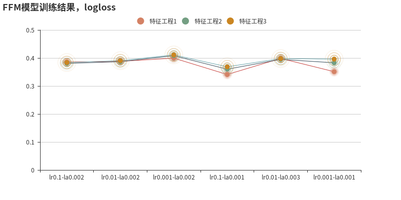
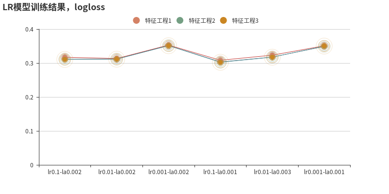
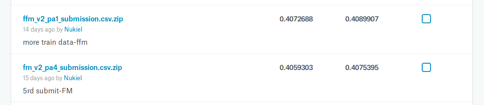
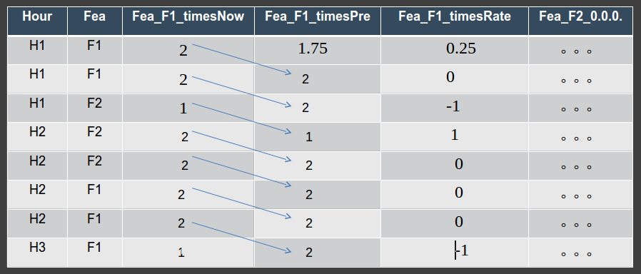
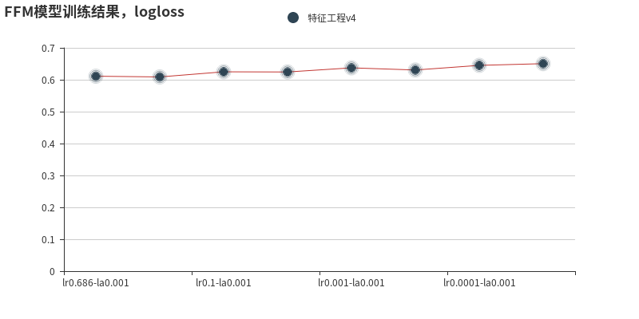
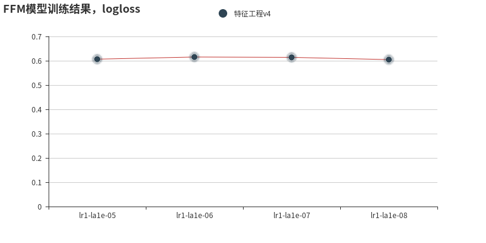
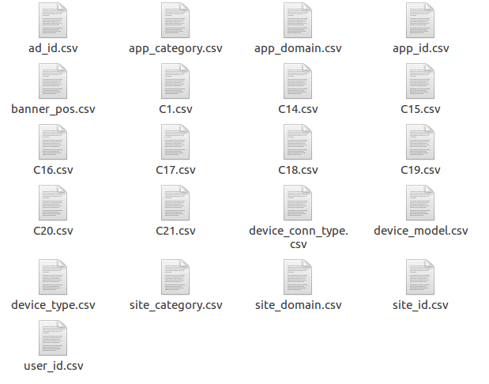

# 第三章 FFM/FM模型

作者：雷坤 (Nukiel)
日期：2018/7/8
[TOC]

## 3.1 FFM模型理论学习


FFM全称是Field-aware Factorization Machines.

由于LR模型进行独热编码后,每个特征的取值变成了新的一个特征,而LR对于每个维度的特征权重w的学习是独立的, 这就使得LR模型无法学习各个维度特征的组合特性及权重.

为了解决这个问题,相继出现了 改进模型Poly2和FM模型,Poly2即degree-2 polynomial  mappings，它对于每一对组合特征都会学习一个权重，Poly2考虑特征的两两组合；FM则是通过把特征组合分解成两个隐向量的内积来学习组合特征的权重，理论上可以提取任意高维组合特征，但是出于计算复杂度的考虑，实际往往也只是到2维组合特征。

FFM模型从推荐系统模型PITF发展而来, 将特征进行了分组,即field. FFM模型石油台湾大学的阮毓钦在当年参加kaggle的criteo竞赛时提出来的, 他们根据Michael Jahrer论文中关于field的概念将FM模型进行了升级.

FM模型的方程为:

$$
y(\mathbf{x}) = w_0+ \sum_{i=1}^n w_i x_i + \sum_{i=1}^n  \sum_{j=i+1}^n \langle \mathbf{v}_i, \mathbf{v}_j \rangle x_i x_j  \tag{1}
$$
而FFM模型的方程为:
$$
y(\mathbf{x}) = w_0 + \sum_{i=1}^n w_i x_i + \sum_{i=1}^n  \sum_{j=i+1}^n \langle \mathbf{v}_{i, f_j}, \mathbf{v}_{j, f_i} \rangle  x_i x_j \tag{2}
$$
从公式即可知道FFM与FM模型的不同之处在于, 对于每个特征定义了其所对应的field, 即fi和fj.

FFM的预测复杂度是 
$$
O(kn^2)
$$
其中k为隐藏向量的长度,一般取4, n为特征维数.

阮毓钦他们已经将FFM的代码开源,即libffm, 之后也有xlearn等模型,他们采用的数据格式都保持了和libffm一样.即:

所有的特征必须转换成“field_id:feat_id:value”格式，field_id代表特征所属field的编号，feat_id是特征编号，value是特征的值。

数值型的特征比较容易处理，只需分配单独的field编号，如用户评论得分、商品的历史CTR/CVR等。

categorical特征需要经过One-Hot编码成数值型，编码产生的所有特征同属于一个field，而特征的值只能是0或1，如用户的性别、年龄段，商品的品类id等。

除此之外，还有第三类特征，如用户浏览/购买品类，有多个品类id且用一个数值衡量用户浏览或购买每个品类商品的数量。这类特征按照categorical特征处理，不同的只是特征的值不是0或1，而是代表用户浏览或购买数量的数值。

按前述方法得到field_id之后，再对转换后特征顺序编号，得到feat_id，特征的值也可以按照之前的方法获得。

FFM模型需要注意如下细节:

第一，样本归一化。FFM默认是进行样本数据的归一化,否则会造成计算梯度时出现nan错误.

第二，特征归一化。CTR/CVR模型采用了多种类型的源特征，包括数值型和categorical类型等。但是，categorical类编码后的特征取值只有0或1，较大的数值型特征会造成样本归一化后categorical类生成特征的值非常小，没有区分性。所以对于比如时间(换算成小时).购买商品的总数,历史点击总数等,都需要进行归一化.

第三，省略零值特征。从FFM模型的公式可以看出，零值特征对模型完全没有贡献。包含零值特征的一次项和组合项均为零，对于训练模型参数或者目标值预估是没有作用的。因此，可以省去零值特征，提高FFM模型训练和预测的速度，这也是稀疏样本采用FFM的显著优势。

第四，FFM需要设定early stopping，因为FFM很容易过拟合。

libffm的开源地址为：

github：https://github.com/guestwalk/libffm


## 3.2 FFM特征处理-第一阶段

### 3.2.1 特征处理方法1

```python
# 剔除特征app_id,site_id,site_domain,c14
# 对剩下的特征分为3类进行不同的处理：

# 对特征取值中计数大于10的进行独热编码,小于10次的统统归为一起,独热编码
count_category_features = ['app_domain',
                        'device_model',
                        'C17', 'C20']

# 对特征的每个取值进行独热编码
each_category_features = ['C1','banner_pos',
                        'site_category',
                        'app_category',
                        'device_type','device_conn_type',
                        'C15', 'C16', 'C18', 'C19','C21'
                        ]

# 连续值,对取值不进行独热编码,而是填入数值
continuous_value_features = ['hour',#填入点击率
                            'device_id','device_ip' #填入点击率,测试集中点击率等于0
                            ]
```

​    

```python
# 根据特征的fiel特性，进行field编号
# fields编号字典
fields_index={}

fields_index['app_domain'] = 1
fields_index['device_model'] = 2
fields_index['C17'] = 3
fields_index['C20'] = 4

fields_index['C1'] = 5
fields_index['banner_pos'] = 6
fields_index['site_category'] = 7
fields_index['app_category'] = 8
fields_index['device_type'] = 9
fields_index['device_conn_type'] = 10
fields_index['C15'] = 11
fields_index['C16'] = 12
fields_index['C18'] = 13
fields_index['C19'] = 14
fields_index['C21'] = 15

fields_index['hour'] = 16
fields_index['device_id'] = 17
fields_index['device_ip'] = 18
```

### 3.2.2 特征处理方法2

```python
# 不剔除特征app_id,site_id,site_domain,c14

# 对特征取值中计数大于10的进行独热编码,小于10次的统统归为一起,独热编码
count_category_features = ['site_id','site_domain',
                        'app_id','app_domain',
                        'device_model',
                        'C14','C17', 'C20'
                        ]

# 对特征的每个取值进行独热编码
each_category_features = ['C1','banner_pos',
                        'site_category',
                        'app_category',
                        'device_type','device_conn_type',
                        'C15', 'C16', 'C18', 'C19','C21'
                        ]

# 连续值,对取值不进行独热编码,而是填入数值
continuous_value_features = ['hour',#填入点击率
                            'device_id','device_ip' #填入点击率,测试集中点击率等于0
                            ]
```

​    

```python
# 根据特征的fiel特性，进行field编号
# fields编号字典
fields_index={}

fields_index['site_id'] = 1
fields_index['site_domain'] = 2
fields_index['app_id'] = 3
fields_index['app_domain'] = 4
fields_index['device_model'] = 5
fields_index['C14'] = 6
fields_index['C17'] = 6
fields_index['C20'] = 7

fields_index['C1'] = 8
fields_index['banner_pos'] = 9
fields_index['site_category'] = 10
fields_index['app_category'] = 11
fields_index['device_type'] = 12
fields_index['device_conn_type'] = 13
fields_index['C15'] = 14
fields_index['C16'] = 14
fields_index['C18'] = 15
fields_index['C19'] = 16
fields_index['C21'] = 17

fields_index['hour'] = 18
fields_index['device_id'] = 19
fields_index['device_ip'] = 19
```


### 3.2.3 特征处理方法3

```python
# 不剔除特征app_id,site_id,site_domain,c14
# 增加C15XC16，hour_int，day_week，hour_day四个特征

# 对特征取值中计数大于10的进行独热编码,小于10次的统统归为一起,独热编码
count_category_features = ['site_id','site_domain',
                        'app_id','app_domain',
                        'device_model',
                        'C14','C17', 'C20'
                        ]

# 对特征的每个取值进行独热编码
each_category_features = ['C1','banner_pos',
                        'site_category',
                        'app_category',
                        'device_type','device_conn_type',
                        'C15', 'C16', 'C15XC16','C18', 'C19','C21',
                        'day_week','hour_day'
                        ]

# 连续值,对取值不进行独热编码,而是填入数值
continuous_value_features = ['hour_int',#距离第一天的小时数,最后采用最大最小值归一化填数
                            'device_id','device_ip' #填入点击率,测试集中点击率等于0
                            ]
```

​    

```python
# 根据特征的fiel特性，进行field编号
# fields编号字典
fields_index={}

fields_index['site_id'] = 1
fields_index['site_domain'] = 2
fields_index['app_id'] = 3
fields_index['app_domain'] = 4
fields_index['device_model'] = 5
fields_index['C14'] = 6
fields_index['C17'] = 6
fields_index['C20'] = 7

fields_index['C1'] = 8
fields_index['banner_pos'] = 9
fields_index['site_category'] = 10
fields_index['app_category'] = 11
fields_index['device_type'] = 12
fields_index['device_conn_type'] = 13
fields_index['C15'] = 14
fields_index['C16'] = 14
fields_index['C15XC16'] = 14
fields_index['C18'] = 15
fields_index['C19'] = 16
fields_index['C21'] = 17
fields_index['day_week'] = 18
fields_index['hour_day'] = 18

fields_index['hour_int'] = 18
fields_index['device_id'] = 19
fields_index['device_ip'] = 19
```


## 3.3 FFM模型训练-第一阶段

### 3.3.1 数据样集

将train.csv按照日期141021~141030分成了10份数据集，并且这10份数据集进行了随机打乱。

模型的训练集train_sample200w.csv从141021~1410229这9份数据集中随机挑选5.6%的数据，最终整合为一个大约200w的随机训练样集。

从141030这份数据集中随机抽取1/40的数据，分别当作验证样集validate_sample10w.csv和测试样集test_sample10w.csv。

### 3.3.2 超参数假定

```python
# 采用的优化方法为adagrad
# 学习率lr分别设定了0.001,0.01,0.1三个取值
# 采用L2正则，正则化参数分别设定了0.002,0.001,0.003三个取值

param =[]
param.append({'task':'binary', 'lr':0.1, 'lambda':0.002, 'metric':'auc','epoch':20})
param.append({'task':'binary', 'lr':0.01, 'lambda':0.002, 'metric':'auc','epoch':20})
param.append({'task':'binary', 'lr':0.001, 'lambda':0.002, 'metric':'auc','epoch':20})
param.append({'task':'binary', 'lr':0.1, 'lambda':0.001, 'metric':'auc','epoch':20})
param.append({'task':'binary', 'lr':0.01, 'lambda':0.003, 'metric':'auc','epoch':20})
param.append({'task':'binary', 'lr':0.001, 'lambda':0.001, 'metric':'auc','epoch':20})
```


## 3.4 FFM结果分析-第一阶段



从图中可以发现：

特征工程2得到了在测试集上最好的结果：0.36001，

特征工程3得到了最差的结果:0.41111。

从三个不同的特征工程走势发现：

1. 学习率不易太小，0.1附近比较好
2. 正则参数不易太大，0.001附近比较好


对于同样的特征工程，喂给FM模型和LR模型，得到结果如下：


FM模型：特征工程2得到了在测试集上最好的结果:0.3644,特征工程3得到了最差的结果:0.41281




LR模型：特征工程3得到了在测试集上最好的结果：0.30227,特征工程1得到了最差的结果：0.35296


综合上面的实验：

1. 学习率不易太小，0.1附近比较好
2. 正则参数不易太大，0.001附近比较好

## 3.5 kaggle得分-第一阶段




## 3.6 FFM特征处理-第二阶段

对第一阶段的结果进行了梳理,同时根据第二周各位同学的介绍, 决定进行第二阶段的特征处理,主要的思想是增加通过时间的衍生特征.

即对于某一行数据, 分别增加原来特征在本行时间点出现的次数, 以及本行时间点之前一个时间点出现的次数, 有了这两个前后时间的次数统计,就再衍生出这个特征在前后时间的次数增长率.

图示如下:




对于特征Fea的每一个取值(F1/F2),将衍生出三个特征,如F1这个取值:Fea_F1_timesNow,Fea_F1_timesPre和Fea_F1_timesRate。


同时，在增加了用户id和广告id：


用户id，User_id等于 device_ip和device_model两个字符串特征合并后取hash值。

广告id，Ad_id等于C14和C17两个特征字符化后合并取hash值。


这样就再衍生出了Ad_id在时间上对User_id的三个新的特征：


比如上面的图示，在H2时刻，广告3876对用户573873展示的次数为2，根据上面介绍的办法，就能得出广告对用户在各个时间上的次数，以及之前时刻次数，和次数的增长率。


所以第二阶段模型的特征工程将存在如下不同的特征处理办法：

```python
# 对特征的每个取值进行独热编码
each_category_features = ['C1','banner_pos',
                        'site_category',
                        'app_category',
                        'device_type','device_conn_type',
                        'C15', 'C16', 'C15XC16','C18', 'C19','C20','C21',
                        'day_week','hour_day'
                        ]

# 距离第一天的小时数,采用最大最小值归一化填数
continuous_value_features = ['hour_int']

# 对特征的每个取值衍生出当前小时出现次数x_times,前一个小时出现次数想_timespre,前后小数出现次数增量x_timesrate
# 对于衍生的每个取值的三个特征都采用最大最小值归一化
derive_category_features = ['C1','banner_pos',
                        'site_category',
                        'app_category',
                        'app_domain',
                        'C15', 'C16', 'C18', 'C19','C20','C21',
                        'ad_id']

# 对广告ad_id对其他在特征衍生出的当前小时出现次数x_times,前一个小时出现次数想_timespre,前后小数出现次数增量x_timesrate
# 对于衍生的这三个特征为连续变量,采用最大最小值归一化
derive_ad_features = ['ad_f_user']
```

## 3.7 数据样集-第二阶段

对于数据集，发现第一阶段没有进行正负样本均衡取值的问题。因此，本次也进行了这方面的改进工作：


首先，将原始的数据集按照一个小时拆分为240份，每一份进行随机打乱，然后在对240份随机打乱获得新的随机训练集。示意图如下：


对于每个时间的打乱后的数据集，再拆分为正负样本两个文件，对于正样本每个时间点提取约29%的样本作为batch，而负样本中则提取与正样本一样多的数据作为batch。

对240份小数据集做同样的随机抽取工作，将得到一个本地训练的小数据集mini_train.csv文件，大约200W行左右的数据量。处理的示意图如下：


## 3.8 模型训练-第二阶段

第一次的参数设置如下：

```python
param =[]
param.append({'task':'binary', 'lr':0.686, 'lambda':0.001, 'metric':'auc','epoch':20}) 
param.append({'task':'binary', 'lr':0.686, 'lambda':0.0001, 'metric':'auc','epoch':20}) 
param.append({'task':'binary', 'lr':0.1, 'lambda':0.001, 'metric':'auc','epoch':20}) 
param.append({'task':'binary', 'lr':0.1, 'lambda':0.0001, 'metric':'auc','epoch':20}) 
param.append({'task':'binary', 'lr':0.001, 'lambda':0.001, 'metric':'auc','epoch':20}) 
param.append({'task':'binary', 'lr':0.001, 'lambda':0.0001, 'metric':'auc','epoch':20}) 
param.append({'task':'binary', 'lr':0.0001, 'lambda':0.001, 'metric':'auc','epoch':20}) 
param.append({'task':'binary', 'lr':0.0001, 'lambda':0.0001, 'metric':'auc','epoch':20}) 
```

在自己创造的测试集上的结果如下：



从结果来看，很不理想！

分析后发现应该出现了欠拟合现象！

将学习率设置为1，正则化参数设置很小。

```python
param =[]
param.append({'task':'binary', 'lr':1, 'lambda':0.00001, 'metric':'auc','epoch':20}) 
param.append({'task':'binary', 'lr':1, 'lambda':0.000001, 'metric':'auc','epoch':20}) 
param.append({'task':'binary', 'lr':1, 'lambda':0.0000001, 'metric':'auc','epoch':20}) 
param.append({'task':'binary', 'lr':1, 'lambda':0.00000001, 'metric':'auc','epoch':20})
```



结果稍微好点！ 但是仍然不够理想！


增加了这么些特征，怎么反而使得结果变差了呢？

最后2周一直再思考这个问题，数据随机化和均衡化都考虑了，难道是200w行的训练样本对于这样的特征处理工程还不够，因为本地机器内存有限，也没法全部数据集来做这个事情，因为了xlearn这个工具，tinymind上没法执行。


所以第二阶段的辛苦尝试，只能到这里了。

## 3.9 kaggle得分-第二阶段


拿到kaggle上看看分数多少：


简直惨不忍睹！！！


第二阶段的特征工程，花了非常多的心思，采用了很多技巧，反而取得了最差的效果。


写到这里，我的心情是郁闷的！


我感觉第二阶段的特征工程，应该会有更好的结果呀，就本项目而言，已经没有时间允许我找原因了，只能停住写总结报告。


## 4.0 FFM/FM总结

第一阶段的时候，踩过坑如下：

1. 原来从github上fork了一个充满坑的代码，浪费了好多时间，是很多时间！所以最保险的是选用成熟的轮子，最好的还是自己多做，多试验，这样就能积累更多好用的轮子，做起来就会得心应手。这应该算我第一次参加kaggle竞赛，以后会多多参加，在不断的尝试中找到学习方法，积累好的工具和思想；

   

2. 训练集，验证集和测试集的各个特征取值不完全一样，在进行编码的时候要统一考虑；

   

3. 在开始写代码前，务必要领会模型的数学意义，如果能推到出来，就更好了。否则根本就没办法在出问题时候进行问题的解析；

   

第二阶段的时候，踩过的坑如下：

1. 文件小了，执行的效率就会高？NO！NO！我把时间相关的特征统计次数放在小文件中：

   

   ​      每个文件都不大，小的就几个k，大的也就几M，但是在编码的时候执行起来超级慢，超级慢，因为每一次编码都要进行读取文件的操作，对于内存是压力小了，但读取文件是要时间的！当次数多了，就无法忽略了。

   这里，浪费了我2天的时间。。。。。

   ​       所以最后我把这些文件在编码前，提前读入到内存中，结果3个小时就把训练集编码好了。

2. 为了提高执行效率，我采用了多线程的办法，将要处理的而文件，分割了若干份，用了6个线程同时来处理编码数据。

   时间确是缩短了，但是有一个坑就是最终递交的测试集，在递交结果的时候需要按照原来的id顺序递交。因为多线程执行的时候编码后的每行数据顺序已经和原来不一样了。

   

这三周的CTR项目，我们组的另外两个小伙伴，谢飞和付雄给予了我不少不少建议，    我们每周都有进行项目语音讨论，本来最后会做一个三个人的不同模型融合的工作，因为各自负责的模型，进展没有预料的顺利，最后也没有得以进行融合递交结果。


但是，我想我们都从这个项目中学到了很多东西，也从一个项目的角度来审视自己如何才能更好的teamwork，以及发现自己存在的诸多不足之处。


作为一个以写程序为业余兴趣爱好的船舶设计工程师，我想我获得收获更加多，首先是，结识了很多优秀的程序员同学以及这么优秀的培训老师；其次是，我从中确是学习了很多知识，了解了很多前沿的技术，对于我现在的工作也是有很多帮助的，或许我也有可能转行到AI这个行业，这个确是比我设计船舶更有挑战和好玩。


最后，谢谢卿老师和智老师以及各位认真负责的助教老师，本来想最后一次直播的时候表达我内心感谢之情的，因为windows笔记本挂掉了，最终的PPT毁掉了，拖累了我们team，也错失了最后一次交流的机会，这是本次学习的最大遗憾!


## 参考文献

1. [【github】libffm下载](https://www.csie.ntu.edu.tw/~r01922136/libffm/)
2. [【博客】美团深入FFM原理与实践](http://tech.meituan.com/deep-understanding-of-ffm-principles-and-practices.html)
3. [【论文】libffm原理](http://www.csie.ntu.edu.tw/~r01922136/slides/ffm.pdf)
4. [【博客】CTR预估算法之FM, FFM, DeepFM及实践](https://blog.csdn.net/john_xyz/article/details/78933253)
5. [【API】xlearn文档](http://xlearn-doc.readthedocs.io/en/latest/command_line.html)
6. [【博客】推荐系统遇上深度学习 (一) FM模型理论和实践](https://mp.weixin.qq.com/s?__biz=MzI1MzY0MzE4Mg==&mid=2247483878&idx=1&sn=0a94aff9156bf2902096c77ca2122372&chksm=e9d01127dea79831de1d1d126549cba1996994c210d0be2ae0004b718fd348909b425fe15fe2&scene=21#wechat_redirect)
7. [【博客】推荐系统遇上深度学习(二) -FFM模型理论和实践](https://mp.weixin.qq.com/s?__biz=MzI1MzY0MzE4Mg==&mid=2247483886&idx=1&sn=d333c173163c4909bcd92f07bae5963e&chksm=e9d0112fdea798393a883496197cf680dc5b06c0f53c723ae45c49553e28dd1bf718d48a0646&scene=21#wechat_redirect)
8. [【博客】CTR预估特征工程](https://blog.csdn.net/supinyu/article/details/52351465)
9. [【博客】推荐系统遇上深度学习（四）-多值离散特征的embedding解决方案](https://cloud.tencent.com/developer/news/188316)
10. [【博客】平均数编码：针对高基数定性特征（类别特征）的数据预处理/特征工程](https://blog.csdn.net/juzexia/article/details/78581462)
11.  [【博客】通过 sklearn 进行大规模机器学习](http://wulc.me/2017/08/08/%E9%80%9A%E8%BF%87%20sklearn%20%E8%BF%9B%E8%A1%8C%E5%A4%A7%E8%A7%84%E6%A8%A1%E6%9C%BA%E5%99%A8%E5%AD%A6%E4%B9%A0/)