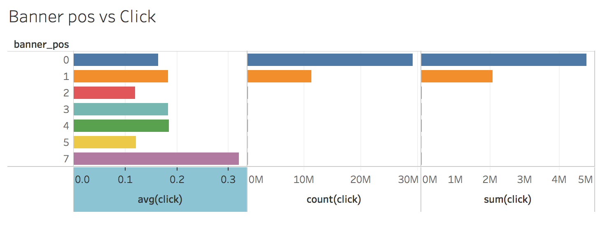

# **LR** **模型**

W2:LR 模型W2.1 LR模型理论学习W2.2 特征处理2.2.1 MeanEncoder2.2.2 Poly2.2.3 特征处理方法3W2.3 FFM模型训练2.3.1 数据样集2.3.2 超参数假定W2.4 FFM结果分析W2.5 FFM填坑总结参考文献

## **1 LR 模型理论学习**

LR模型即是逻辑回归模型，在简单的线性回归模型上，增加了的一层逻辑函数。但是逻辑函数的适用范围非常的狭窄，在复杂的数据集中的预测效果非常不理想。

logistic回归是一种广义线性回归（generalized linear model），因此与多重线性回归分析有很多相同之处。它们的模型形式基本上相同，都具有 w‘x+b，其中w和b是待求参数，其区别在于他们的因变量不同，多重线性回归直接将w‘x+b作为因变量，即y =w‘x+b，而logistic回归则通过函数L将w‘x+b对应一个隐状态p，p =L(w‘x+b),然后根据p 与1-p的大小决定因变量的值。如果L是logistic函数，就是logistic回归，如果L是多项式函数就是多项式回归

逻辑斯蒂是一种变量的分布方式，和常见的指数分布、高斯分布等类似，它也有自己的概率分布函数和概率密度函数.


他们的图形如下图所示：


### Logistic回归模型的适用条件

1 因变量为二分类的分类变量或某事件的发生率，并且是数值型变量。但是需要注意，重复计数现象指标不适用于Logistic回归。

2 残差和因变量都要服从二项分布。二项分布对应的是分类变量，所以不是正态分布，进而不是用最小二乘法，而是最大似然法来解决方程估计和检验问题。

3 自变量和Logistic概率是线性关系

4 各观测对象间相互独立。

### Logistic回归实质

发生概率除以没有发生概率再取对数。就是这个不太繁琐的变换改变了取值区间的矛盾和因变量自变量间的曲线关系。究其原因，是发生和未发生的概率成为了比值 ，这个比值就是一个缓冲，将取值范围扩大，再进行对数变换，整个因变量改变。不仅如此，这种变换往往使得因变量和自变量之间呈线性关系，这是根据大量实践而总结。所以，Logistic回归从根本上解决因变量要不是连续变量怎么办的问题。还有，Logistic应用广泛的原因是许多现实问题跟它的模型吻合。例如一件事情是否发生跟其他数值型自变量的关系。

所以在CTR预估中，LR模型是一种非常常用的模型，并且能够取得不错的成绩。

 

## **2** **特征处理**

### **2.1 MeanEncoder**

因为考虑到LR模型对连续数值型的优势，而对于类别型特征不是特别友好，

而LabelEncoder会丢失掉一些信息，

OneHotEncoder又会增加非常多的维度，这都是我们不希望发生的

所以，我在做数据探索的时候，发现后验概率体现了与Click关系非常大的值，

就突发奇想，用点击率在每个特征的后验概率作为编码值，取代原来的特征值

如图：

上图是C1 在Click上的统计数据。Count代表C1当前值出现的次数，Sum代表C1当前值点击率的总数，Avg代表C1当前取值的点击率。

 



上图是Banner pos 在Click上的统计数据。Count代表Banner pos当前值出现的次数，Sum代表Banner pos当前值点击率的总数，Avg代表Banner pos当前取值的点击率。

由以上两个图表可以看出，曝光数越多，点击率并不是成正比关系。有可能是某种类别的广告过多的出现，反而引起了用户的反感。

在此，就以Avg（click）的取值作为当前特征的编码，进行重新编码。

如图所示，将上图中，C1的1005特征，用统计表中的Avg（click）取值代替原先的1005插入到新的数据表中。

```python
def insert_click_rate(train_file, rate_file_path, feature_list, output):
    train_rate = pd.read_csv(train_file) 
    print('before merge shape：',train_rate.shape)
    for column in feature_list:
        rate = pd.read_csv(rate_file_path+'clickVS'+column+'.csv', usecols=[column,'avg(click)'])
        train_rate = pd.merge(train_rate,rate,how='left')
        print('after {} merge ,shape:{}'.format(column,train_rate.shape))
        train_rate.rename(columns={'avg(click)':column+'_rate'}, inplace = True)
        train_rate.drop([column],inplace = True, axis=1)
    train_rate.to_csv(output,index=False)
    print('inset rate result shape:', train_rate.shape)
    return train_rate

```

优点：连续型数值型特征，在LR模型下，也可以很方便的做Polynomial的特征组合

缺点：在一个下采样率为0.05的小数据集上耗时非常多，目测有1个小时


### 2.2 Polynomial 变换

比如现在有两个特征x1,x2.我们首先会拿这两个特征作为全部特征去建立模型，完了发现，哎呀，做出来的模型真差呀。 
此时可以尝试将原始的特征进行多项式的扩展。

比如在多远线性回归中，可以根据两个特征建立回归方程：y = a0 + a1x1 + a2x2,这样的模型是线性的，如果样本点的实际分布是非线性的，那么用单纯的线性模型去预测自然是不好的喽。

如果将特征进行3维的转换，多项式的扩展后原来的（x1,x2)就变成了(x1, x2)^3. 
展开后就是：(x1, x1^2, x1^3, x2, x2^2, x2^3, x1x2, x1^2x2, x1x2^2) 
也就是说将2个特征进行3维多项式的扩展就变成了9个特征了。可以预测非线性的分布。

当维度越高的时候对样本点的拟合可能就越精准。但是！并不是维度越高越好，因为会造成对训练集的过拟合，从而丧失了模型的泛化能力。

2个特征进行3维的多项式转换后变成了9个特征。

以上的方法，尤其是2,3，并非是适合所有的情况，建模的过程也是对特征的探索与测试的过程，当原有的特征并不能很好地拟合样本点时，可以尝试将特征进行相乘或多项式展开的转换，有可能会有更好的效果，但并不是绝对的。

```python
def poly(train_file, output_file, degree = 2):
    X = pd.read_csv(train_file)
    X_train = X.drop(['id','click'],axis=1)
    poly = PolynomialFeatures(degree=degree)

    X_train = poly.fit_transform(X_train)
    X_train = pd.DataFrame(X_train)
    print(X_train.shape)
    print(X_train.head())
    X_train.to_csv(output_file, index=False)
    return X_train

```


## 3 超参数的选择

按照正常的LR模型的超参数，这里采用了GridSearch，得到了如下的最优解。

•penaltys = ['l1','l2']

•Cs = [0.001, 0.01, 0.1]

•最好的参数组合以及评分是：

•'C': 0.01, 'penalty': 'l1’

•Loss = 0.311881

### 3.1 结果分析

在训练集的CV上，最优情况评分为0.309158964

由于计算资源有限，选择了Train数据集上的抽样进行特征工程。

第一次提交和第二次分别是50w和200w的数据。

| Submission | Private Score | Public Score |
| ---------- | ------------- | ------------ |
| 1          | 0.5317915     | 0.5324564    |
| 2          | 0.4579208     | 0.4599311    |
| 3          | 0.4634562     | 0.4654680    |

第三次提交是50W数据经过Poly多项式变换后的结果。200w的数据集经过多项式变换后，在TinyMind上跑了3天，没有出结果，于是放弃。

从这三个提交结果可以看出，训练的数据集越大，确实是会对预测的成绩有所提高。但是为什么实际的预测Logloss与本地CV的Logloss差别这么大？

我后来才发现，这是因为之前的所使用的平均值编码，是站在了上帝视角，错误的使用了真值，这就导致本地CV结果非常优秀，但是实际是过拟合的。于是开始研究MeanEncoder的修正版。


### 3.2 修正版的MeanEncoder

如果某一个特征是定性的（categorical），而这个特征的可能值非常多（高基数），那么平均数编码（mean encoding）是一种高效的编码方式。在实际应用中，这类特征工程能极大提升模型的性能。

在机器学习与数据挖掘中，不论是分类问题（classification）还是回归问题（regression），采集的数据常常会包括定性特征（categorical  feature）。因为定性特征表示某个数据属于一个特定的类别，所以在数值上，定性特征值通常是从0到n的离散整数。例子：花瓣的颜色（红、黄、蓝）、性别（男、女）、地址、某一列特征是否存在缺失值（这种NA 指示列常常会提供有效的额外信息）。

 一般情况下，针对定性特征，我们只需要使用sklearn的OneHotEncoder或LabelEncoder进行编码：（data_df是一个pandas  dataframe，每一行是一个training  example，每一列是一个特征。在这里我们假设"street_address"是一个字符类的定性特征。）

 LabelEncoder能够接收不规则的特征列，并将其转化为从0~ n-1的整数值（假设一共有种不同的类别）；OneHotEncoder则能通过哑编码，制作出一个m*n的稀疏矩阵（假设数据一共有m行，具体的输出矩阵格式是否稀疏可以由sparse参数控制）。

更详细的API文档参见：[sklearn.preprocessing.LabelEncoder  - scikit-learn 0.18.1 documentation](http://link.zhihu.com/?target=http%3A//scikit-learn.org/stable/modules/generated/sklearn.preprocessing.LabelEncoder.html)以及[sklearn.preprocessing.OneHotEncoder  - scikit-learn 0.18.1 documentation](http://link.zhihu.com/?target=http%3A//scikit-learn.org/stable/modules/generated/sklearn.preprocessing.OneHotEncoder.html)

这类简单的预处理能够满足大多数数据挖掘算法的需求。

值得一提的是，LabelEncoder将n种类别编码为从0到n-1的整数，虽然能够节省内存和降低算法的运行时间，但是隐含了一个假设：不同的类别之间，存在一种顺序关系。在具体的代码实现里，LabelEncoder会对定性特征列中的所有独特数据进行一次排序，从而得出从原始输入到整数的映射。

定性特征的基数（cardinality）指的是这个定性特征所有可能的不同值的数量。在高基数（high cardinality）的定性特征面前，这些数据预处理的方法往往得不到令人满意的结果。

高基数定性特征的例子：IP地址、电子邮件域名、城市名、家庭住址、街道、产品号码。

#### 主要原因：

1.  LabelEncoder编码高基数定性特征，虽然只需要一列，但是每个自然数都具有不同的重要意义，对于y而言线性不可分。使用简单模型，容易欠拟合（underfit），无法完全捕获不同类别之间的区别；使用复杂模型，容易在其他地方过拟合（overfit）。
2.  OneHotEncoder编码高基数定性特征，必然产生上万列的稀疏矩阵，易消耗大量内存和训练时间，除非算法本身有相关优化（例：SVM）。

因此，我们可以尝试使用平均数编码（mean encoding）的编码方法，在贝叶斯的架构下，利用所要预测的应变量（target variable），有监督地确定最适合这个定性特征的编码方式。在Kaggle的数据竞赛中，这也是一种常见的提高分数的手段。

 

#### 基本思路与原理：

平均数编码是一种有监督（supervised）的编码方式，适用于分类和回归问题。为了简化讨论，以下的所有代码都以分类问题作为例子。

假设在分类问题中，目标y一共有C个不同类别，具体的一个类别用target表示；某一个定性特征variable一共有K个不同类别，具体的一个类别用k表示。

**先验概率（prior）**：数据点属于某一个target（y）的概率，P(y = target)

**后验概率（posterior）**：该定性特征属于某一类时，数据点属于某一个target（y）的概率，P(target = y | variable = k) 

本算法的基本思想：将variable中的每一个k，都表示为（估算的）它所对应的目标y值概率：。（估算的结果都用“^”表示，以示区分）

因此，整个数据集将增加（C-1）列。是C-1而不是C的原因：
，所以最后一个的概率值必然和其他的概率值线性相关。在线性模型、神经网络以及SVM里，不能加入线性相关的特征列。如果你使用的是基于决策树的模型（gbdt、rf等），个人仍然不推荐这种over-parameterization。

 

#### 先验概率与后验概率的计算：

因为我们没有上帝视角，所以我们在计算中，需要利用已有数据估算先验概率和后验概率。我们在此使用的具体方法被称为Empirical Bayes（[Empirical  Bayes method](http://link.zhihu.com/?target=https%3A//en.wikipedia.org/wiki/Empirical_Bayes_method)）。和一般的贝叶斯方法（如常见的Laplace Smoothing）不同，我们在估算先验概率时，会使用已知数据的平均值，而不是。

权重：

我们已经得到了先验概率估计和后验概率估计。最终编码所使用的概率估算，应当是先验概率与后验概率的一个凸组合（convex  combination）。由此，我们引入先验概率的权重来计算编码所用概率,

或：

直觉上，应该具有以下特性：

1.  如果测试集中出现了新的特征类别（未在训练集中出现），那么。
2.  一个特征类别在训练集内出现的次数越多，后验概率的可信度越高，其权重也越大。

在贝叶斯统计学中，

也被称为shrinkage  parameter。

#### 权重函数：

我们需要定义一个权重函数，输入是特征类别在训练集中出现的次数n，输出是对于这个特征类别的先验概率的权重。假设一个特征类别的出现次数为n，以下是一个常见的权重函数：

这个函数有两个参数：

 k：当时，，先验概率与后验概率的权重相同；当时，。

 f：控制函数在拐点附近的斜率，f越大，“坡”越缓。

当(freq_col - k) / f太大的时候，np.exp可能会产生overflow的警告。我们不需要管这个警告，因为某一类别的频数极高，分母无限时，最终先验概率的权重将成为0，这也表示我们对于后验概率有充足的信任。

 

#### 延伸

以上的算法设计能解决多个（>2）类别的分类问题，自然也能解决更简单的2类分类问题以及回归问题。

还有一种情况：定性特征本身包括了不同级别。例如，国家包含了省，省包含了市，市包含了街区。有些街区可能就包含了大量的数据点，而有些省却可能只有稀少的几个数据点。这时，我们的解决方法是，在empirical bayes里加入不同层次的先验概率估计。

以下为MeanEncoder的关键代码实现。																

```python
def mean_encode_subroutine(X_train, y_train, X_test, variable, target, prior_weight_func):
        X_train = X_train[[variable]].copy()
        X_test = X_test[[variable]].copy()
 
        if target is not None:
            nf_name = '{}_pred_{}'.format(variable, target)
            X_train['pred_temp'] = (y_train == target).astype(int)  # classification
        else:
            nf_name = '{}_pred'.format(variable)
            X_train['pred_temp'] = y_train  # regression
        prior = X_train['pred_temp'].mean()
 
        col_avg_y = X_train.groupby(by=variable, axis=0)['pred_temp'].agg({'mean': 'mean', 'beta': 'size'})
        col_avg_y['beta'] = prior_weight_func(col_avg_y['beta'])
        col_avg_y[nf_name] = col_avg_y['beta'] * prior + (1 - col_avg_y['beta']) * col_avg_y['mean']
        col_avg_y.drop(['beta', 'mean'], axis=1, inplace=True)
 
        nf_train = X_train.join(col_avg_y, on=variable)[nf_name].values
        nf_test = X_test.join(col_avg_y, on=variable).fillna(prior, inplace=False)[nf_name].values
 
        return nf_train, nf_test, prior, col_avg_y
 
```

以下是使用了平均编码后，在不同体量集的训练数据（50w, 200w）上的预测结果。

| Submission | Private Score | Public Score |
| ---------- | ------------- | ------------ |
| 1          | 0.406         | 0.407        |
| 2          | 0.3981232     | 0.39978483   |

## 4 经验与总结

- 高基数的类别型特征可以采用均值编码的方式

这样即可以比较好的保留数据集中的统计信息，也可以避免OnehotEncoder带来的巨大稀疏矩阵

- 错误的平均值编码导致了模型的过拟合
- 数据集太大，计算力有限对特征特征的选取和采用的特征工程方法有很大局限性
- 特征在时间上的挖掘还不够


参考资料：

1. [平均数编码：针对高基数定性特征（类别特征）的数据预处理/特征工程](https://blog.csdn.net/juzexia/article/details/78581462)
2. [[百度百科]Logistic回归](https://baike.baidu.com/item/logistic%E5%9B%9E%E5%BD%92/2981575?fromtitle=%E9%80%BB%E8%BE%91%E5%9B%9E%E5%BD%92&fromid=17202449&fr=aladdin)

