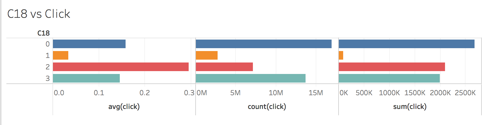

# CTR 项目汇报


# 1. 数据探索

作者：谢飞(Orchid)，付雄(fuxi)，雷坤 (Nukiel)
日期：2018/7/8
[TOC]

## 1.1 特征意义及推测

对于一支广告的投放，可以描述为这样一种行为，即在某地，某个时候， 通过某种途径，在某种平台上，向某类对象展示某种形式的信息传播方式。

而能够被点击则意味着这个传播得到了反馈,是有效的投放。影响用户能够对广告的进行点击的因素很多，比如广告是否足够吸引眼球，展示的内容是否刚好就是用户查找的东西，这些因素会导致用户主动去点击广告；但是，很多时候用户取点击广告是一个“被迫”行为，比如观看视频前的插入广告，浏览新闻的内容植入广告，弹窗广告等，用户不想点击，但是不点击就影响了他正常的阅览；最后，还有很多广告是通过误导用户去点击，比如关闭的X很难找，触摸屏展示时用户很容易就点击了广告而不是关掉广告。

因为广告都是讨人厌的，某只广告刚刚被用户误点了或者主动去点了，它接着马上又弹出来了，很多人就很恼火，这个时候再去点击这个广告概率就很低，也就是说用户的历史点击某只广告会影响其下次点击这个广告的可能性。

对训练集进行每个特征去重数据统计，得到如下表：

&nbsp;                                                                              **表1: 特征统计表**

| 特征             | 特征取值                                       | 特征取值总数 |
| ---------------- | ---------------------------------------------- | ------------ |
| id               | 5.21159374e+11                                 | 40428967     |
| click            | 0,1                                            | 2            |
| hour             | 14102100 14102101                              | 240          |
| C1               | 1001 1002 1005 1007 1008 1010 1012             | 7            |
| banner_pos       | 0 1 2 3 4 5 7                                  | 8            |
| site_id          | '000aa1a4' ' ... 'fffe8e1c'                    | 4737         |
| site_domain      | '004d30ed' ... 'ffdec903'                      | 7745         |
| site_category    | '0569f928' …'f66779e6'                         | 26           |
| app_id           | '000d6291' ... 'ffef3b38'                      | 8552         |
| app_domain       | 'fea0d84a'…'ff6630e0'                          | 559          |
| app_category     | 'd1327cf5' …'fc6fa53d'                         | 36           |
| device_id        | '00000919' ... 'ffffde2c'                      | 2686408      |
| device_ip        | '00000911' ... 'fffff971'                      | 6729486      |
| device_model     | '000ab70c' ... 'ffe72be2'                      | 8251         |
| device_type­­­   | 0 1 2 4 5                                      | 5            |
| device_conn_type | 0 2 3 5                                        | 4            |
| C14              | 375 ... 24052                                  | 2626         |
| C15              | 120    216  300  320    480  728  768 1024     | 8            |
| C16              | 20     36   50   90    250  320  480  768 1024 | 9            |
| C17              | 112…2758                                       | 435          |
| C18              | 0 1 2 3                                        | 4            |
| C19              | 33…1959                                        | 68           |
| C20              | -1 100000 100001…100248                        | 172          |
| C21              | 1 … 219                                        | 60           |

 

基于上面的分析，对于数据集中的24个特征，可以向分几个大类：

1. 何时
    hour：可以抽取为哪天，哪小时

    **时间代表了用户的广告点击历史，历史浏览会对未来广告点击产生影响**


2. 何地
    site_id：网站编号，某个场地的唯一标识
    site_domain：网页地址
    site_category：网站类别，这个场地可能是网页，视频网站，社交社区之类的
    **不同的网站用户流量不一样，比如Facebook的广告点击率必然比我的个人博客广告点击率；而不同类别网站也会影响广告点击，比如优酷和新华网，我想优酷的广告点击率应该比新华网高，因为优酷实在太流氓**

    app_id：应用程序的编号
    app_domain：应用程序领域
    app_category：应用程序类别
    **应用程序，不同的类别程序，对广告点击应该有一定影响，比如游戏类的APP，投放游戏广告，点击率会高些**


3. 何平台
    device_id：设备标识，比如苹果5,华为 P8之类的
    device_model：设备模式，？
    device_type：设备类型，比如可能是苹果，华为，小米，黑莓等
    device_ip：设备ip，上网的ip地址
    device_conn_type：上网的连接方式，比如移动上网，WIFI等
    **平台对广告的影响也是很重要，比如苹果手机上豪车豪宅的广告点击率必然比小米手机上广告的点击率高些，这里不是黑小米用户，我这里只是陈述一个概率事实。又比如，WIFI上网点击广告的概率肯定比用移动上网的高些，试问谁会用移动流量去点个广告，浪费时间和金钱？[土豪例外]。ip地址基本可以代表用户的区域特征，不同区域的用户对于广告的点击会有影响，比如美国的ip和越南的ip，他们对橄榄球广告的点击率必然不一样**


4. 何种方式
    banner_pos：广告展示位置
    C1：难以推测，很可能是广告的展示形式，比如视频，文字，弹窗等
    C14：无法推测
    C15 X C16：广告的尺寸,比如iphone4/4s的是320 X 480,ipad1/2的是768 X 1024
    C17：无法推测
    C18：无法推测
    C19：无法推测
    C20：无法推测
    C21：无法推测
    **广告的展示方式是体现广告商功力的地方，所以这里很多信息都被脱敏处理了，这些特征中的各个类除非对点击率影响均衡，也就是方差很小，可以忽略，否则都应该输入模型进行训练**


5. 何人
    数据集中没有明确给出，也不方便给出。其实何人会是影响广告点击的一个重要变量，比如女生对于女性用品的广告点击会很高，而男生对于汽车游戏类的广告点击会更高；30岁左右的成年人会对婴幼儿广告更加感冒，而60岁的人会对保健品更加感兴趣等等，但是这些有关性别，年龄，教育水平等用户隐私的数据是受到保护的，就算广告商有这个数据，也不会公布出来。
    欧盟《通用数据保护条例》规定，违规泄露用户隐私数据，企业将面临高达全球营业额２％至４％的罚款。
    我们这里基本上可以用device_id或者device_ip来作为用户的代号

  

## 1.2 特征分析

### 1.2.1 全局点击率

```python
i=0
fea0=pd.read_csv('../Input/train/'+basecol+'VS'+corcol[i]+'.csv')
global_CTR=np.sum(np.sum(fea0[fea0.columns[2]]))/np.sum(np.sum(fea0[fea0.columns[1]]))*100
print('训练集的全局点击率为: %6.2f %%' % global_CTR)
```

    训练集的全局点击率为:  16.98 %

**整个训练集的平均点击率16.98%将作为考量各个特征中不同取值的重要性指标,如果比整个平均值大,那么就处于相对重要的地位.**

### 1.2.2 hour

    按12个时辰分割的时间与点击率的统计表:
    +----+--------+----------------+--------------+--------------+
    |    | hour   |   count(click) |   sum(click) |   avg(click) |
    |----+--------+----------------+--------------+--------------|
    |  0 | 0-1    |    1.82996e+06 |       335376 |     0.183269 |
    |  1 | 2-3    |    2.62167e+06 |       459027 |     0.175089 |
    |  2 | 4-5    |    3.89553e+06 |       629171 |     0.161511 |
    |  3 | 6-7    |    3.62046e+06 |       629230 |     0.173799 |
    |  4 | 8-9    |    4.37266e+06 |       706581 |     0.16159  |
    |  5 | 10-11  |    4.20179e+06 |       696402 |     0.16574  |
    |  6 | 12-13  |    4.60531e+06 |       780787 |     0.16954  |
    |  7 | 14-15  |    4.28494e+06 |       768185 |     0.179276 |
    |  8 | 16-17  |    4.07995e+06 |       719585 |     0.176371 |
    |  9 | 18-19  |    3.07661e+06 |       511894 |     0.166383 |
    | 10 | 20-21  |    2.11361e+06 |       339411 |     0.160584 |
    | 11 | 22-23  |    1.72648e+06 |       289417 |     0.167635 |
    +----+--------+----------------+--------------+--------------+


    hour之CTR分布图:


    hour统计表:
           count(click)     sum(click)  avg(click)
    count  1.200000e+01      12.000000   12.000000
    mean   3.369081e+06  572088.833333    0.170066
    std    1.053165e+06  178455.709957    0.007456
    min    1.726476e+06  289417.000000    0.160584
    25%    2.494657e+06  429123.000000    0.164702
    50%    3.757991e+06  629200.500000    0.168588
    75%    4.222575e+06  709832.000000    0.175410
    max    4.605313e+06  780787.000000    0.183269

**中国古人根据动物出没习性将24小时分了12个时辰,这里也按照12个时辰将每天分为12份,进行广告点击率的时间分布统计.**
**从上面的分析可知,不同的时间段,其分布标准差非常小,说明不同时段的点击率差异很小.**


**但是从按照时间序列绘制的图,可知某些时段，广告出现次数比较多，点击数也比较多，呈现一个高峰，但是点击率却是低谷。**

**对于时间这个变量可以做点文章**

### 1.2.3 C1

脱敏特征的统计汇总：

|          | C1       | C14      | C15      | C16      | C17      | C18      | C19      | C20      | C21      |
| -------- | -------- | -------- | -------- | -------- | -------- | -------- | -------- | -------- | -------- |
| 总数     | 40428967 | 40428967 | 40428967 | 40428967 | 40428967 | 40428967 | 40428967 | 40428967 | 40428967 |
| 独一数   | 7        | 2626     | 8        | 9        | 435      | 4        | 68       | 172      | 60       |
| 最高频值 | 1005     | 4687     | 320      | 50       | 1722     | 0        | 35       | 65535    | 23       |
| 最高频次 | 37140632 | 948215   | 37708959 | 38136554 | 4513492  | 16939044 | 12170630 | 18937918 | 8896205  |


```python
i=1
fea=pd.read_csv('../Input/train/'+basecol+'VS'+corcol[i]+'.csv')
np.set_printoptions(suppress=True)
print(corcol[i]+'与点击率的统计表:'+'共'+str(len(fea))+'不同取值')
print(tabulate(fea, headers='keys', numalign="left",tablefmt='psql'))
```

    C1与点击率的统计表:共7不同取值
    +----+------+----------------+--------------+--------------+
    |    | C1   | count(click)   | sum(click)   | avg(click)   |
    |----+------+----------------+--------------+--------------|
    | 0  | 1001 | 9463           | 316          | 0.0333932    |
    | 1  | 1002 | 2.22081e+06    | 467995       | 0.210731     |
    | 2  | 1005 | 3.71406e+07    | 6.28906e+06  | 0.169331     |
    | 3  | 1007 | 35304          | 1392         | 0.039429     |
    | 4  | 1008 | 5787           | 704          | 0.121652     |
    | 5  | 1010 | 903457         | 86023        | 0.0952154    |
    | 6  | 1012 | 113512         | 19580        | 0.172493     |
    +----+------+----------------+--------------+--------------+
```
C1之CTR分布图:
```


**C1这个变量点击率分布很分散,从对模型训练的角度,能够体现差异,是优质特征**

**取值1002 和 1005，几乎占领了90%以上的广告投放量。就点击数1005这个取值是被点击最多的，**

### 1.2.4 banner_pos


```python
i=2
fea=pd.read_csv('../Input/train/'+basecol+'VS'+corcol[i]+'.csv')
np.set_printoptions(suppress=True)
print(corcol[i]+'与点击率的统计表:'+'共'+str(len(fea))+'不同取值')
print(tabulate(fea, headers='keys', numalign="left",tablefmt='psql'))
```

    banner_pos与点击率的统计表:共7不同取值
    +----+--------------+----------------+--------------+--------------+
    |    | banner_pos   | count(click)   | sum(click)   | avg(click)   |
    |----+--------------+----------------+--------------+--------------|
    | 0  | 0            | 2.91096e+07    | 4.7819e+06   | 0.164272     |
    | 1  | 1            | 1.12473e+07    | 2.06516e+06  | 0.183614     |
    | 2  | 2            | 13001          | 1550         | 0.119222     |
    | 3  | 3            | 2035           | 372          | 0.182801     |
    | 4  | 4            | 7704           | 1428         | 0.185358     |
    | 5  | 5            | 5778           | 702          | 0.121495     |
    | 6  | 7            | 43577          | 13949        | 0.3201       |
    +----+--------------+----------------+--------------+--------------+


    banner_pos之CTR分布图:


**banner_pos这个变量点击率分散程度也还行,需要注意的是取值7的点击率尤其高,这个位置很可能是屏幕中间位置,展示出来会影响用户阅读,没办法必须要点掉. 这种广告不能投放太多.**

**在位置0和位置1，几乎占领了90%以上的广告投放量。**

### 1.2.5 site_id

和网站有关的三个类别型变量统计：

|          | site_id  | site_domain | site_category |
| -------- | -------- | ----------- | ------------- |
| 总数     | 40428967 | 40428967    | 40428967      |
| 独一数   | 4737     | 7745        | 26            |
| 最高频值 | 85f751fd | c4e18dd6    | 50e219e0      |
| 最高频数 | 14596137 | 15131739    | 16537234      |


```python
i=3
fea=pd.read_csv('../Input/train/'+basecol+'VS'+corcol[i]+'.csv')
fea=fea.sort_values(by=[fea.columns[1]],ascending=False)
np.set_printoptions(suppress=True)
print(corcol[i]+'与点击率的统计表:'+'共'+str(len(fea))+'不同取值')
print(tabulate(fea.iloc[:20], headers='keys', numalign="left",tablefmt='psql'))
```

    site_id与点击率的统计表:共4737不同取值
    +------+-----------+----------------+--------------+--------------+
    |      | site_id   | count(click)   | sum(click)   | avg(click)   |
    |------+-----------+----------------+--------------+--------------|
    | 2494 | 85f751fd  | 14596137       | 1734407      | 0.118826     |
    | 582  | 1fbe01fe  | 6486150        | 1333764      | 0.205633     |
    | 4158 | e151e245  | 2637747        | 781628       | 0.296324     |
    | 4032 | d9750ee7  | 963745         | 269965       | 0.280121     |
    | 1748 | 5b08c53b  | 913325         | 426710       | 0.467205     |
    | 1753 | 5b4d2eda  | 771360         | 100287       | 0.130013     |
    | 2486 | 856e6d3f  | 765891         | 32746        | 0.0427554    |
    | 3093 | a7853007  | 461311         | 47188        | 0.102291     |
    | 3395 | b7e9786d  | 369099         | 27319        | 0.0740154    |
    | 1816 | 5ee41ff2  | 349008         | 115605       | 0.331239     |
    | 1909 | 6399eda6  | 343703         | 36411        | 0.105937     |
    | 1762 | 5bcf81a2  | 340050         | 39284        | 0.115524     |
    | 1891 | 6256f5b4  | 315840         | 55596        | 0.176026     |
    | 1705 | 57ef2c87  | 310760         | 37732        | 0.121418     |
    | 431  | 17caea14  | 278322         | 67720        | 0.243315     |
    | 194  | 0a742914  | 269725         | 72358        | 0.268266     |
    | 2456 | 83a0ad1a  | 268735         | 22871        | 0.0851061    |
    | 1708 | 57fe1b20  | 264952         | 65312        | 0.246505     |
    | 4212 | e4d8dd7b  | 259347         | 30990        | 0.119492     |
    | 4293 | e8f79e60  | 259289         | 66207        | 0.255341     |
    +------+-----------+----------------+--------------+--------------+


    site_id统计表:
           count(click)    sum(click)   avg(click)
    count  4.737000e+03  4.737000e+03  4737.000000
    mean   8.534720e+03  1.449243e+03     0.179476
    std    2.372673e+05  3.479911e+04     0.226505
    min    1.000000e+00  0.000000e+00     0.000000
    25%    5.000000e+00  0.000000e+00     0.000000
    50%    3.700000e+01  4.000000e+00     0.107976
    75%    3.850000e+02  4.400000e+01     0.250000
    max    1.459614e+07  1.734407e+06     1.000000


**网站的编号对于点击率的标准差应该不会很低,不同的网站,点击率肯定有差别,但是网站编号实在太多了,编码后维度爆炸是不得不考虑的问题.**

**从点击数和投放数看，投放的越多，点击数就越大，这个结果也符合一般的常识**

### 1.2.6 site_domain


```python
i=4
fea=pd.read_csv('../Input/train/'+basecol+'VS'+corcol[i]+'.csv')
fea=fea.sort_values(by=[fea.columns[1]],ascending=False)
np.set_printoptions(suppress=True)
print(corcol[i]+'与点击率的统计表:'+'共'+str(len(fea))+'不同取值')
print(tabulate(fea.iloc[:20], headers='keys', numalign="left",tablefmt='psql'))
```

    site_domain与点击率的统计表:共7745不同取值
    +------+---------------+----------------+--------------+--------------+
    |      | site_domain   | count(click)   | sum(click)   | avg(click)   |
    |------+---------------+----------------+--------------+--------------|
    | 6000 | c4e18dd6      | 15131739       | 1857423      | 0.12275      |
    | 7339 | f3845767      | 6486150        | 1333764      | 0.205633     |
    | 3893 | 7e091613      | 3325008        | 859040       | 0.258357     |
    | 3666 | 7687a86e      | 1290165        | 593264       | 0.459836     |
    | 4672 | 98572c79      | 996816         | 273496       | 0.27437      |
    | 686  | 16a36ef3      | 855686         | 121731       | 0.142261     |
    | 2736 | 58a89a43      | 765891         | 32746        | 0.0427554    |
    | 4841 | 9d54950b      | 375891         | 42231        | 0.112349     |
    | 5417 | b12b9f85      | 373925         | 27991        | 0.0748573    |
    | 725  | 17d996e6      | 353600         | 116237       | 0.328725     |
    | 4615 | 968765cd      | 343703         | 36411        | 0.105937     |
    | 1294 | 28f93029      | 315842         | 55598        | 0.176031     |
    | 5772 | bd6d812f      | 310760         | 37732        | 0.121418     |
    | 6421 | d262cf1e      | 289921         | 6403         | 0.0220853    |
    | 417  | 0dde25ec      | 278322         | 67720        | 0.243315     |
    | 2516 | 510bd839      | 269725         | 72358        | 0.268266     |
    | 2859 | 5c9ae867      | 268735         | 22871        | 0.0851061    |
    | 2822 | 5b626596      | 265874         | 65346        | 0.245778     |
    | 4970 | a17bde68      | 259347         | 30990        | 0.119492     |
    | 5986 | c4342784      | 259289         | 66207        | 0.255341     |
    +------+---------------+----------------+--------------+--------------+
    
    site_domain统计表:
           count(click)    sum(click)   avg(click)
    count  7.745000e+03  7.745000e+03  7745.000000
    mean   5.220009e+03  8.863868e+02     0.188611
    std    1.927291e+05  2.890054e+04     0.272498
    min    1.000000e+00  0.000000e+00     0.000000
    25%    1.000000e+00  0.000000e+00     0.000000
    50%    7.000000e+00  1.000000e+00     0.071429
    75%    6.600000e+01  9.000000e+00     0.264695
    max    1.513174e+07  1.857423e+06     1.000000


**site_domain应该指网站域名还是网页地址?**

**根据其数目比网站编号多,认为理解为网页地址更合理.这个特征和网站地址一样,不同的取值对点击率会有比较明显的影响,但存在维度爆炸的危险**

**site_domain这个特征和site_id的分布很类似**

### 1.2.7 site_category


```python
i=5
fea=pd.read_csv('../Input/train/'+basecol+'VS'+corcol[i]+'.csv')
fea=fea.sort_values(by=[fea.columns[1]],ascending=False)
np.set_printoptions(suppress=True)
print(corcol[i]+'与点击率的统计表:'+'共'+str(len(fea))+'不同取值')
print(tabulate(fea, headers='keys', numalign="left",tablefmt='psql'))
```

    site_category与点击率的统计表:共26不同取值
    +----+-----------------+----------------+--------------+--------------+
    |    | site_category   | count(click)   | sum(click)   | avg(click)   |
    |----+-----------------+----------------+--------------+--------------|
    | 6  | 50e219e0        | 16537234       | 2126350      | 0.12858      |
    | 24 | f028772b        | 12657073       | 2272940      | 0.179579     |
    | 2  | 28905ebd        | 7377208        | 1534600      | 0.208019     |
    | 4  | 3e814130        | 3050306        | 863245       | 0.283003     |
    | 25 | f66779e6        | 252451         | 10019        | 0.0396869    |
    | 12 | 75fa27f6        | 160985         | 17915        | 0.111284     |
    | 3  | 335d28a8        | 136463         | 12779        | 0.0936444    |
    | 13 | 76b2941d        | 104754         | 3170         | 0.0302614    |
    | 19 | c0dd3be3        | 42090          | 4714         | 0.111998     |
    | 10 | 72722551        | 28216          | 1626         | 0.0576269    |
    | 22 | dedf689d        | 24500          | 12593        | 0.514        |
    +----+-----------------+----------------+--------------+--------------+
    
    site_category统计表:
           count(click)    sum(click)  avg(click)
    count  2.600000e+01  2.600000e+01   26.000000
    mean   1.554960e+06  2.640410e+05    0.098765
    std    4.169734e+06  6.625992e+05    0.115663
    min    2.000000e+00  0.000000e+00    0.000000
    25%    3.592500e+02  6.250000e+00    0.013143
    50%    1.229400e+04  7.520000e+02    0.065621
    75%    1.285358e+05  1.194950e+04    0.134254
    max    1.653723e+07  2.272940e+06    0.514000


**网站/网页类别的取值不同,对于点击率的影响也会不同,从标准差看,影响的差异比网站的取值要小点,也就是说优酷的游戏频道和电影频道,上面的广告点击率有差别,但是差别没有youtube电影频道和优酷电影频道上的点击率差别大.**

**从图和表发现，category为*dedf689d* 的site 广告点击率非常高，而投放数却非常低，在图上几乎肉眼不可见。通常影响广告投放的数量，除了点击率，还有一个就是广告的价格，这个取值的广告点击率如此之高，投放量却很少，应该是性价比不高的。 ** 

### 1.2.8 app_id

和app有关的三个类别特征的统计汇总如下：

|          | app_id   | app_domain | app_category |
| -------- | -------- | ---------- | ------------ |
| 总数     | 40428967 | 40428967   | 40428967     |
| 独一数   | 8552     | 559        | 36           |
| 最高频值 | ecad2386 | 7801e8d9   | 07d7df22     |
| 最高频数 | 25832830 | 27237087   | 26165592     |


```python
i=6
fea=pd.read_csv('../Input/train/'+basecol+'VS'+corcol[i]+'.csv')
fea=fea.sort_values(by=[fea.columns[1]],ascending=False)
np.set_printoptions(suppress=True)
print(corcol[i]+'与点击率的统计表:'+'共'+str(len(fea))+'不同取值')
print(tabulate(fea.iloc[:20], headers='keys', numalign="left",tablefmt='psql'))
```

    app_id与点击率的统计表:共8552不同取值
    +------+----------+----------------+--------------+--------------+
    |      | app_id   | count(click)   | sum(click)   | avg(click)   |
    |------+----------+----------------+--------------+--------------|
    | 7884 | ecad2386 | 25832830       | 5130659      | 0.19861      |
    | 4904 | 92f5800b | 1555283        | 30014        | 0.0192981    |
    | 7558 | e2fcccd2 | 1129016        | 219689       | 0.194584     |
    | 8510 | febd1138 | 759098         | 36597        | 0.0482112    |
    | 5187 | 9c13b419 | 757812         | 231387       | 0.305336     |
    | 3882 | 7358e05e | 615635         | 115311       | 0.187304     |
    | 5506 | a5184c22 | 491457         | 121513       | 0.247251     |
    | 7058 | d36838b1 | 457572         | 32497        | 0.0710205    |
    | 3521 | 685d1c4c | 408515         | 31055        | 0.0760192    |
    | 2837 | 54c5d545 | 397693         | 49410        | 0.124242     |
    | 109  | 03528b27 | 322121         | 44256        | 0.137389     |
    | 8014 | f0d41ff1 | 294244         | 17657        | 0.060008     |
    | 7778 | e9739828 | 284750         | 7990         | 0.0280597    |
    | 7547 | e2a1ca37 | 281215         | 39231        | 0.139505     |
    | 2698 | 51cedd4e | 239107         | 12469        | 0.0521482    |
    | 3472 | 66f5e02e | 226077         | 51263        | 0.22675      |
    | 122  | 03a08c3f | 218767         | 12532        | 0.0572847    |
    | 5099 | 98fed791 | 218766         | 29975        | 0.137019     |
    | 3873 | 73206397 | 200058         | 5883         | 0.0294065    |
    | 8181 | f53417e1 | 199043         | 13805        | 0.0693569    |
    +------+----------+----------------+--------------+--------------+
    
    app_id统计表:
           count(click)    sum(click)   avg(click)
    count  8.552000e+03  8.552000e+03  8552.000000
    mean   4.727428e+03  8.027439e+02     0.183707
    std    2.807550e+05  5.563412e+04     0.278578
    min    1.000000e+00  0.000000e+00     0.000000
    25%    2.000000e+00  0.000000e+00     0.000000
    50%    8.000000e+00  1.000000e+00     0.034093
    75%    5.100000e+01  5.000000e+00     0.263158
    max    2.583283e+07  5.130659e+06     1.000000


**app编号与网站编号一样,点击率的标准差也不低,编码维度爆炸是不得不考虑的问题.**

### 1.2.9 app_domain


```python
i=7
fea=pd.read_csv('../Input/train/'+basecol+'VS'+corcol[i]+'.csv')
fea=fea.sort_values(by=[fea.columns[1]],ascending=False)
np.set_printoptions(suppress=True)
print(corcol[i]+'与点击率的统计表:'+'共'+str(len(fea))+'不同取值')
print(tabulate(fea.iloc[:20], headers='keys', numalign="left",tablefmt='psql'))
```

    app_domain与点击率的统计表:共559不同取值
    +-----+--------------+----------------+--------------+--------------+
    |     | app_domain   | count(click)   | sum(click)   | avg(click)   |
    |-----+--------------+----------------+--------------+--------------|
    | 254 | 7801e8d9     | 27237087       | 5307891      | 0.194877     |
    | 75  | 2347f47a     | 5240885        | 723839       | 0.138114     |
    | 378 | ae637522     | 1881838        | 44753        | 0.0237815    |
    | 200 | 5c5a694b     | 1129228        | 219699       | 0.194557     |
    | 282 | 82e27996     | 759125         | 36598        | 0.0482108    |
    | 478 | d9b5648e     | 713924         | 79275        | 0.111041     |
    | 19  | 0e8616ad     | 660510         | 46766        | 0.0708029    |
    | 410 | b9528b13     | 646193         | 116883       | 0.180879     |
    | 407 | b8d325c3     | 534000         | 124073       | 0.232346     |
    | 380 | aefc06bd     | 298769         | 21369        | 0.0715235    |
    | 490 | df32afa9     | 291502         | 8129         | 0.0278866    |
    | 110 | 33da2e74     | 259530         | 31133        | 0.119959     |
    | 241 | 6f7ca2ba     | 226100         | 51263        | 0.226727     |
    | 197 | 5b9c592b     | 104413         | 5990         | 0.0573683    |
    | 290 | 885c7f3f     | 68310          | 11490        | 0.168204     |
    | 201 | 5c620f04     | 60268          | 1648         | 0.0273445    |
    | 147 | 45a51db4     | 56138          | 11291        | 0.201129     |
    | 400 | b5f3b24a     | 48199          | 1912         | 0.0396689    |
    | 278 | 813f3323     | 25338          | 2915         | 0.115045     |
    | 8   | 0654b444     | 23298          | 4679         | 0.200833     |
    +-----+--------------+----------------+--------------+--------------+
    
    app_domain统计表:
           count(click)    sum(click)  avg(click)
    count  5.590000e+02  5.590000e+02  559.000000
    mean   7.232373e+04  1.228098e+04    0.149005
    std    1.177570e+06  2.268175e+05    0.267377
    min    1.000000e+00  0.000000e+00    0.000000
    25%    2.000000e+00  0.000000e+00    0.000000
    50%    6.000000e+00  1.000000e+00    0.014388
    75%    4.850000e+01  4.000000e+00    0.153846
    max    2.723709e+07  5.307891e+06    1.000000


**图中灰色，玫红色代表着这类领域的APP广告投放量比较多，点击数也相应的增大。**

**从点击率的分布和标准差看，存在一点的差别**

**app的领域和类别取值还不算太多, 可以保留进入训练.**

### 1.2.10 app_category


```python
i=8
fea=pd.read_csv('../Input/train/'+basecol+'VS'+corcol[i]+'.csv')
fea=fea.sort_values(by=[fea.columns[1]],ascending=False)
np.set_printoptions(suppress=True)
print(corcol[i]+'与点击率的统计表:'+'共'+str(len(fea))+'不同取值')
print(tabulate(fea, headers='keys', numalign="left",tablefmt='psql'))
```

    app_category与点击率的统计表:共36不同取值
    +----+----------------+----------------+--------------+--------------+
    |    | app_category   | count(click)   | sum(click)   | avg(click)   |
    |----+----------------+----------------+--------------+--------------|
    | 0  | 07d7df22       | 26165592       | 5210822      | 0.199148     |
    | 4  | 0f2161f8       | 9561058        | 1033720      | 0.108118     |
    | 29 | cef3e649       | 1731545        | 161450       | 0.0932404    |
    | 21 | 8ded1f7a       | 1467257        | 132021       | 0.0899781    |
    | 34 | f95efa07       | 1141673        | 282664       | 0.247588     |
    | 30 | d1327cf5       | 123233         | 15197        | 0.123319     |
    | 1  | 09481d60       | 54886          | 8518         | 0.155194     |
    | 31 | dc97ec06       | 54644          | 8552         | 0.156504     |
    | 17 | 75d80bbe       | 40108          | 3849         | 0.0959659    |
    | 35 | fc6fa53d       | 23663          | 1148         | 0.0485146    |
    | 11 | 4ce2e9fc       | 20762          | 2570         | 0.123784     |
    | 20 | 879c24eb       | 12785          | 1339         | 0.104732     |
    | 23 | a3c42688       | 11121          | 525          | 0.047208     |
    | 9  | 4681bb9d       | 6291           | 908          | 0.144333     |
    | 5  | 0f9a328c       | 5584           | 867          | 0.155265     |
    | 25 | a86a3e89       | 2497           | 325          | 0.130156     |
    | 7  | 2281a340       | 2243           | 30           | 0.0133749    |
    +----+----------------+----------------+--------------+--------------+


    app_category统计表:
           count(click)    sum(click)  avg(click)
    count  3.600000e+01  3.600000e+01   36.000000
    mean   1.123027e+06  1.906963e+05    0.082989
    std    4.589204e+06  8.788938e+05    0.077941
    min    1.000000e+00  0.000000e+00    0.000000
    25%    1.425000e+01  7.500000e-01    0.005639
    50%    1.142000e+03  4.500000e+01    0.080366
    75%    2.777425e+04  2.889750e+03    0.146233
    max    2.616559e+07  5.210822e+06    0.259678


**这个特征各个取值类别不多，各个取值的点击率比较一致，其中有两个取值07d7df22和f95efa07点击率是高于全局平均点击率的，这两个取值的广告投放数连也很大**

### 1.2.11 device_id

和设备有关的几个特征的统计如下：

|          | device_id | device_ip | device_model | device_type | device_conn_type |
| -------- | --------- | --------- | ------------ | ----------- | ---------------- |
| 总数     | 40428967  | 40428967  | 40428967     | 40428967    | 40428967         |
| 独一数   | 2686408   | 6729486   | 8251         | 5           | 4                |
| 最高频值 | a99f214a  | 6b9769f2  | 8a4875bd     | 1           | 0                |
| 最高频数 | 33358308  | 208701    | 2455470      | 37304667    | 34886838         |


```python
i=9
fea=pd.read_csv('../Input/train/'+basecol+'VS'+corcol[i]+'.csv')
fea=fea.sort_values(by=[fea.columns[1]],ascending=False)
np.set_printoptions(suppress=True)
print(corcol[i]+'与点击率的统计表:'+'共'+str(len(fea))+'不同取值')
print(tabulate(fea.iloc[:20], headers='keys', numalign="left",tablefmt='psql'))
```

    device_id与点击率的统计表:共2686408不同取值
    +---------+-------------+----------------+--------------+--------------+
    |         | device_id   | count(click)   | sum(click)   | avg(click)   |
    |---------+-------------+----------------+--------------+--------------|
    | 1780272 | a99f214a    | 33358308       | 5809415      | 0.174152     |
    | 162650  | 0f7c61dc    | 21356          | 16190        | 0.758101     |
    | 2049923 | c357dbff    | 19667          | 12469        | 0.634006     |
    | 1547552 | 936e92fb    | 13712          | 875          | 0.0638127    |
    | 1846569 | afeffc18    | 9654           | 2211         | 0.229024     |
    | 1600102 | 987552d1    | 4187           | 0            | 0            |
    | 429077  | 28dc8687    | 4101           | 0            | 0            |
    | 2270026 | d857ffbb    | 4004           | 900          | 0.224775     |
    | 2171665 | cef4c8cc    | 3694           | 901          | 0.243909     |
    | 1853656 | b09da1c4    | 3655           | 479          | 0.131053     |
    | 638808  | 3cdb4052    | 3069           | 2421         | 0.788856     |
    | 35009   | 03559b29    | 2528           | 0            | 0            |
    | 29916   | 02da5312    | 2497           | 322          | 0.128955     |
    | 2212834 | d2e4c0ab    | 1466           | 0            | 0            |
    | 2537666 | f1d9c744    | 1392           | 0            | 0            |
    | 1801688 | abab24a7    | 1374           | 0            | 0            |
    | 98979   | 096a6f32    | 1369           | 0            | 0            |
    | 1626599 | 9af87478    | 1355           | 126          | 0.0929889    |
    | 1214408 | 73b81e30    | 1182           | 626          | 0.529611     |
    | 1970582 | bbcf14e4    | 1182           | 0            | 0            |
    +---------+-------------+----------------+--------------+--------------+


    device_id统计表:
           count(click)    sum(click)    avg(click)
    count  2.686408e+06  2.686408e+06  2.686408e+06
    mean   1.504945e+01  2.555482e+00  1.795149e-01
    std    2.035252e+04  3.544453e+03  3.551150e-01
    min    1.000000e+00  0.000000e+00  0.000000e+00
    25%    1.000000e+00  0.000000e+00  0.000000e+00
    50%    1.000000e+00  0.000000e+00  0.000000e+00
    75%    2.000000e+00  0.000000e+00  0.000000e+00
    max    3.335831e+07  5.809415e+06  1.000000e+00

**decice_id应该就是手机或者平板等设备的唯一编号,比如苹果5,华为P8之类的,这里发现a99f214a这个id占到了82.5%, 结合这个竞赛是2014年,这个id非常有可能还是苹果4的手机.因为苹果4手机当年号称卖出了1亿部!**
**这个特征取值很多,全部放进去训练是不可能的,它取值的及其不均衡,给我们不丢弃它的理由,可以将排名靠前的5个单独留下,剩下的归为一类处理. 或者进行hash处理，作为代表用户的特征**

### 1.2.12 device_ip


```python
i=10
fea=pd.read_csv('../Input/train/'+basecol+'VS'+corcol[i]+'.csv')
fea=fea.sort_values(by=[fea.columns[1]],ascending=False)
np.set_printoptions(suppress=True)
print(corcol[i]+'与点击率的统计表:'+'共'+str(len(fea))+'不同取值')
print(tabulate(fea.iloc[:20], headers='keys', numalign="left",tablefmt='psql'))
```

    device_ip与点击率的统计表:共6729486不同取值
    +---------+-------------+----------------+--------------+--------------+
    |         | device_ip   | count(click)   | sum(click)   | avg(click)   |
    |---------+-------------+----------------+--------------+--------------|
    | 2829892 | 6b9769f2    | 208701         | 45987        | 0.220349     |
    | 1765109 | 431b3174    | 135322         | 26356        | 0.194765     |
    | 1240642 | 2f323f36    | 88499          | 8734         | 0.0986904    |
    | 4616722 | af9205f9    | 87844          | 8438         | 0.0960566    |
    | 3867252 | 930ec31d    | 86996          | 8171         | 0.0939239    |
    | 4611824 | af62faf4    | 85802          | 8068         | 0.0940304    |
    | 15669   | 009a7861    | 85382          | 8248         | 0.0966012    |
    | 1060593 | 285aa37d    | 85313          | 8145         | 0.095472     |
    | 2619376 | 6394f6f6    | 83184          | 7733         | 0.0929626    |
    | 5706711 | d90a7774    | 82980          | 7705         | 0.0928537    |
    | 5215490 | c6563308    | 71290          | 15180        | 0.212933     |
    | 2309818 | 57cd4006    | 70449          | 15142        | 0.214936     |
    | 3096394 | 75bb1b58    | 70262          | 15041        | 0.21407      |
    | 759912  | 1cf29716    | 70028          | 15089        | 0.215471     |
    | 5831890 | ddd2926e    | 69816          | 14919        | 0.21369      |
    | 118733  | 0489ce3f    | 69756          | 15000        | 0.215035     |
    | 4426221 | a8536f3a    | 69594          | 15076        | 0.216628     |
    | 1907685 | 488a9a3e    | 69550          | 15025        | 0.216032     |
    | 5443218 | ceffea69    | 68731          | 14839        | 0.2159       |
    | 3629101 | 8a014cbb    | 68506          | 14679        | 0.214273     |
    +---------+-------------+----------------+--------------+--------------+


    device_ip统计表:
           count(click)    sum(click)    avg(click)
    count  6.729486e+06  6.729486e+06  6.729486e+06
    mean   6.007735e+00  1.020147e+00  2.027035e-01
    std    1.760677e+02  3.290346e+01  3.489186e-01
    min    1.000000e+00  0.000000e+00  0.000000e+00
    25%    1.000000e+00  0.000000e+00  0.000000e+00
    50%    2.000000e+00  0.000000e+00  0.000000e+00
    75%    3.000000e+00  1.000000e+00  2.857143e-01
    max    2.087010e+05  4.598700e+04  1.000000e+00

**设备的ip地址,分布很广,点击率的标准差也很小,但是很多ip的点击率都不错,其实这个特征可以看作是用户的画像特征,丢了是很可惜,进行独热编码是不太可能,可以考虑采用hash编码**

### 1.2.13 device_model


```python
i=11
fea=pd.read_csv('../Input/train/'+basecol+'VS'+corcol[i]+'.csv')
fea=fea.sort_values(by=[fea.columns[1]],ascending=False)
np.set_printoptions(suppress=True)
print(corcol[i]+'与点击率的统计表:'+'共'+str(len(fea))+'不同取值')
print(tabulate(fea.iloc[:20], headers='keys', numalign="left",tablefmt='psql'))
```

    device_model与点击率的统计表:共8251不同取值
    +------+----------------+----------------+--------------+--------------+
    |      | device_model   | count(click)   | sum(click)   | avg(click)   |
    |------+----------------+----------------+--------------+--------------|
    | 4460 | 8a4875bd       | 2455470        | 339356       | 0.138204     |
    | 934  | 1f0bc64f       | 1424546        | 319798       | 0.224491     |
    | 6949 | d787e91b       | 1405169        | 314574       | 0.223869     |
    | 3805 | 76dc4769       | 767961         | 145386       | 0.189314     |
    | 6078 | be6db1d7       | 742913         | 139977       | 0.188416     |
    | 5189 | a0f5f879       | 652751         | 108704       | 0.166532     |
    | 2484 | 4ea23a13       | 645153         | 136625       | 0.211771     |
    | 3934 | 7abbbd5c       | 636673         | 109847       | 0.172533     |
    | 7645 | ecb851b2       | 613048         | 111005       | 0.181071     |
    | 6855 | d4897fef       | 483582         | 81667        | 0.168879     |
    | 2551 | 5096d134       | 475264         | 80907        | 0.170236     |
    | 3612 | 711ee120       | 447450         | 96062        | 0.214688     |
    | 871  | 1ccc7835       | 426161         | 73671        | 0.172871     |
    | 7278 | e1eae715       | 421122         | 7313         | 0.0173655    |
    | 6334 | c6263d8a       | 397746         | 98506        | 0.247661     |
    | 4287 | 84ebbcd4       | 388015         | 105358       | 0.271531     |
    | 6079 | be74e6fe       | 379729         | 68989        | 0.18168      |
    | 4882 | 981edffc       | 361456         | 6299         | 0.0174267    |
    | 1900 | 3bd9e8e7       | 359934         | 75471        | 0.20968      |
    | 7754 | f07e20f8       | 359464         | 40650        | 0.113085     |
    +------+----------------+----------------+--------------+--------------+


    device_model统计表:
           count(click)     sum(click)   avg(click)
    count  8.251000e+03    8251.000000  8251.000000
    mean   4.899887e+03     832.028360     0.179165
    std    4.554862e+04    8145.354488     0.178233
    min    1.000000e+00       0.000000     0.000000
    25%    7.000000e+00       1.000000     0.057113
    50%    7.800000e+01      13.000000     0.157386
    75%    7.735000e+02     121.000000     0.239055
    max    2.455470e+06  339356.000000     1.000000


**device_model这个理解为手机模式? 取值不少,这个特战是否要保留? 现在还没办法预见和下结论.**

### 1.2.14 device_type


```python
i=12
fea=pd.read_csv('../Input/train/'+basecol+'VS'+corcol[i]+'.csv')
fea=fea.sort_values(by=[fea.columns[1]],ascending=False)
np.set_printoptions(suppress=True)
print(corcol[i]+'与点击率的统计表:'+'共'+str(len(fea))+'不同取值')
print(tabulate(fea, headers='keys', numalign="left",tablefmt='psql'))
```

    device_type与点击率的统计表:共5不同取值
    +----+---------------+----------------+--------------+--------------+
    |    | device_type   | count(click)   | sum(click)   | avg(click)   |
    |----+---------------+----------------+--------------+--------------|
    | 1  | 1             | 3.73047e+07    | 6.31105e+06  | 0.169176     |
    | 0  | 0             | 2.22081e+06    | 467995       | 0.210731     |
    | 3  | 4             | 774272         | 73900        | 0.0954445    |
    | 4  | 5             | 129185         | 12123        | 0.0938422    |
    | 2  | 2             | 31             | 2            | 0.0645161    |
    +----+---------------+----------------+--------------+--------------+


    device_type之CTR分布图:


**device_type从分布来看,绝对好特征,type1可能是iphone,type0可能是ipad**

### 1.2.15 device_conn_type


```python
i=13
fea=pd.read_csv('../Input/train/'+basecol+'VS'+corcol[i]+'.csv')

fea=fea.sort_values(by=[fea.columns[1]],ascending=False)
np.set_printoptions(suppress=True)

print(corcol[i]+'与点击率的统计表:'+'共'+str(len(fea))+'不同取值')
print(tabulate(fea, headers='keys', numalign="left",tablefmt='psql'))
```

    device_conn_type与点击率的统计表:共4不同取值
    +----+--------------------+----------------+--------------+--------------+
    |    | device_conn_type   | count(click)   | sum(click)   | avg(click)   |
    |----+--------------------+----------------+--------------+--------------|
    | 0  | 0                  | 3.48868e+07    | 6.31889e+06  | 0.181125     |
    | 1  | 2                  | 3.31744e+06    | 448815       | 0.135289     |
    | 2  | 3                  | 2.1818e+06     | 96092        | 0.0440426    |
    | 3  | 5                  | 42890          | 1270         | 0.0296106    |
    +----+--------------------+----------------+--------------+--------------+


    device_conn_type之CTR分布图:


**device_conn_type从分布来看,也是绝对好特征,这个应该是值wifi,4g,3g和2g网络**

**注意到，这个特征是唯一个投放量，点击数和点击率分布最为一致的**

### 1.2.16 C14


```python
i=14
fea=pd.read_csv('../Input/train/'+basecol+'VS'+corcol[i]+'.csv')
fea=fea.sort_values(by=[fea.columns[1]],ascending=False)
np.set_printoptions(suppress=True)
print(corcol[i]+'与点击率的统计表:'+'共'+str(len(fea))+'不同取值')
print(tabulate(fea.iloc[:20], headers='keys', numalign="left",tablefmt='psql'))
```

    C14与点击率的统计表:共2626不同取值
    +-----+-------+----------------+--------------+--------------+
    |     | C14   | count(click)   | sum(click)   | avg(click)   |
    |-----+-------+----------------+--------------+--------------|
    | 26  | 4687  | 948215         | 236460       | 0.249374     |
    | 957 | 21611 | 907004         | 50629        | 0.05582      |
    | 819 | 21189 | 765968         | 15231        | 0.0198846    |
    | 821 | 21191 | 765092         | 15051        | 0.0196721    |
    | 643 | 19771 | 730238         | 83215        | 0.113956     |
    | 644 | 19772 | 729305         | 81505        | 0.111757     |
    | 310 | 16208 | 657764         | 80375        | 0.122194     |
    | 685 | 20108 | 587773         | 145677       | 0.247846     |
    | 84  | 8330  | 554444         | 82004        | 0.147903     |
    | 651 | 19950 | 529145         | 65787        | 0.124327     |
    | 284 | 15705 | 510276         | 105412       | 0.206578     |
    | 280 | 15701 | 506797         | 102200       | 0.201659     |
    | 278 | 15699 | 504923         | 101489       | 0.200999     |
    | 282 | 15703 | 503358         | 96907        | 0.192521     |
    | 283 | 15704 | 503315         | 101765       | 0.202189     |
    | 286 | 15707 | 502374         | 99572        | 0.198203     |
    | 287 | 15708 | 502189         | 97222        | 0.193596     |
    | 281 | 15702 | 485719         | 78011        | 0.160609     |
    | 285 | 15706 | 477688         | 69982        | 0.146501     |
    | 328 | 16615 | 438490         | 82402        | 0.187922     |
    +-----+-------+----------------+--------------+--------------+


    C14统计表:
                    C14   count(click)     sum(click)   avg(click)
    count   2626.000000    2626.000000    2626.000000  2626.000000
    mean   20583.797030   15395.646230    2614.267327     0.143636
    std     4154.039762   63454.618282   11639.879551     0.129867
    min      375.000000       1.000000       0.000000     0.000000
    25%    19985.250000      99.000000       8.000000     0.056878
    50%    22108.500000     977.500000      97.000000     0.113040
    75%    22966.750000    4784.750000     604.750000     0.203886
    max    24052.000000  948215.000000  236460.000000     1.000000

**C14标准差不小,Cxx的特征应该是广告商的广告相关的特征,比如多少频次投放一次广告,在什么网站投放什么类型的广告,广告的是视频,弹窗,还是啥形式,广告多大的展示尺寸,在哪里展示,在屏幕上是如何的运动轨迹等等.这些都是广告商的商业秘密,必然要加密处理.**
**但是,可以肯定Cxx这些变量都挺重要,不能剔除掉.**

###1.2.17 C15


```python
i=15
fea=pd.read_csv('../Input/train/'+basecol+'VS'+corcol[i]+'.csv')
fea=fea.sort_values(by=[fea.columns[1]],ascending=False)
np.set_printoptions(suppress=True)
print(corcol[i]+'与点击率的统计表:'+'共'+str(len(fea))+'不同取值')
print(tabulate(fea, headers='keys', numalign="left",tablefmt='psql'))
```

    C15与点击率的统计表:共8不同取值
    +----+-------+----------------+--------------+--------------+
    |    | C15   | count(click)   | sum(click)   | avg(click)   |
    |----+-------+----------------+--------------+--------------|
    | 3  | 320   | 3.7709e+07     | 5.98094e+06  | 0.158608     |
    | 2  | 300   | 2.33729e+06    | 839925       | 0.359358     |
    | 1  | 216   | 298794         | 37988        | 0.127138     |
    | 5  | 728   | 74533          | 4246         | 0.0569681    |
    | 0  | 120   | 3069           | 58           | 0.0188987    |
    | 7  | 1024  | 2560           | 652          | 0.254688     |
    | 4  | 480   | 2137           | 572          | 0.267665     |
    | 6  | 768   | 1621           | 690          | 0.425663     |
    +----+-------+----------------+--------------+--------------+


    C15之CTR分布图:


                   C15  count(click)    sum(click)  avg(click)
    count     8.000000  8.000000e+00  8.000000e+00    8.000000
    mean    494.500000  5.053621e+06  8.581332e+05    0.208623
    std     315.322511  1.321909e+07  2.090365e+06    0.143214
    min     120.000000  1.621000e+03  5.800000e+01    0.018899
    25%     279.000000  2.454250e+03  6.320000e+02    0.109595
    50%     400.000000  3.880100e+04  2.468000e+03    0.206648
    75%     738.000000  8.084190e+05  2.384722e+05    0.290588
    max    1024.000000  3.770896e+07  5.980935e+06    0.425663

###1.2.18 C16

```python
i=16
fea=pd.read_csv('../Input/train/'+basecol+'VS'+corcol[i]+'.csv')
fea=fea.sort_values(by=[fea.columns[1]],ascending=False)
np.set_printoptions(suppress=True)
print(corcol[i]+'与点击率的统计表:'+'共'+str(len(fea))+'不同取值')
print(tabulate(fea, headers='keys', numalign="left",tablefmt='psql'))
```

    C16与点击率的统计表:共9不同取值
    +----+-------+----------------+--------------+--------------+
    |    | C16   | count(click)   | sum(click)   | avg(click)   |
    |----+-------+----------------+--------------+--------------|
    | 2  | 50    | 3.81366e+07    | 6.03759e+06  | 0.158315     |
    | 4  | 250   | 1.80633e+06    | 761093       | 0.421347     |
    | 1  | 36    | 298794         | 37988        | 0.127138     |
    | 6  | 480   | 103365         | 22178        | 0.21456      |
    | 3  | 90    | 74533          | 4246         | 0.0569681    |
    | 0  | 20    | 3069           | 58           | 0.0188987    |
    | 7  | 768   | 2560           | 652          | 0.254688     |
    | 5  | 320   | 2137           | 572          | 0.267665     |
    | 8  | 1024  | 1621           | 690          | 0.425663     |
    +----+-------+----------------+--------------+--------------+


    C16之CTR分布图:


    C16统计表:
                   C16  count(click)    sum(click)  avg(click)
    count     9.000000  9.000000e+00  9.000000e+00    9.000000
    mean    337.555556  4.492107e+06  7.627851e+05    0.216138
    std     357.159317  1.263009e+07  1.993650e+06    0.143900
    min      20.000000  1.621000e+03  5.800000e+01    0.018899
    25%      50.000000  2.560000e+03  6.520000e+02    0.127138
    50%     250.000000  7.453300e+04  4.246000e+03    0.214560
    75%     480.000000  2.987940e+05  3.798800e+04    0.267665
    max    1024.000000  3.813655e+07  6.037589e+06    0.425663

**C15和C16这两个特征应该是屏幕的尺寸之类的参数,比如iphone4/4s的是320 X 480,ipad1/2的是768 X 1024**

**这里有个问题，屏幕的尺寸都是成对出现的，比如iphone4的是320X480，C15的320出现的次数最多，而C16的50出现最多！屏幕尺寸50的设备，是什么有这么多？**

### 1.2.19 C17


```python
i=17
fea=pd.read_csv('../Input/train/'+basecol+'VS'+corcol[i]+'.csv')

fea=fea.sort_values(by=[fea.columns[1]],ascending=False)
np.set_printoptions(suppress=True)

print(corcol[i]+'与点击率的统计表:'+'共'+str(len(fea))+'不同取值')
print(tabulate(fea.iloc[:20], headers='keys', numalign="left",tablefmt='psql'))
```

    C17与点击率的统计表:共435不同取值
    +-----+-------+----------------+--------------+--------------+
    |     | C17   | count(click)   | sum(click)   | avg(click)   |
    |-----+-------+----------------+--------------+--------------|
    | 56  | 1722  | 4.51349e+06    | 855780       | 0.189605     |
    | 168 | 2424  | 1.53107e+06    | 30282        | 0.0197783    |
    | 117 | 2227  | 1.47310e+06    | 166213       | 0.112832     |
    | 63  | 1800  | 1.19016e+06    | 146448       | 0.123049     |
    | 6   | 423   | 948215         | 236460       | 0.249374     |
    | 198 | 2480  | 918663         | 51522        | 0.0560837    |
    | 215 | 2502  | 855087         | 168489       | 0.197043     |
    | 238 | 2528  | 824907         | 110753       | 0.134261     |
    | 219 | 2506  | 803166         | 80738        | 0.100525     |
    | 159 | 2374  | 756358         | 191030       | 0.252566     |
    | 252 | 2545  | 713546         | 160335       | 0.224702     |
    | 69  | 1872  | 695237         | 209234       | 0.300953     |
    | 91  | 1994  | 604968         | 240007       | 0.396727     |
    | 139 | 2299  | 587773         | 145677       | 0.247846     |
    | 236 | 2526  | 586936         | 70734        | 0.120514     |
    | 68  | 1863  | 567425         | 91930        | 0.162013     |
    | 18  | 761   | 558460         | 82406        | 0.147559     |
    | 149 | 2333  | 512860         | 85653        | 0.16701      |
    | 90  | 1993  | 495667         | 178579       | 0.36028      |
    | 356 | 2665  | 485332         | 36939        | 0.0761108    |
    +-----+-------+----------------+--------------+--------------+


    C17统计表:
                   C17  count(click)     sum(click)  avg(click)
    count   435.000000  4.350000e+02     435.000000  435.000000
    mean   2269.000000  9.294015e+04   15781.760920    0.145537
    std     578.309594  2.809635e+05   52424.546677    0.114662
    min     112.000000  1.000000e+00       0.000000    0.000000
    25%    2171.500000  3.223500e+03     304.500000    0.063617
    50%    2504.000000  1.651000e+04    1695.000000    0.120477
    75%    2634.500000  7.060400e+04    8321.500000    0.208647
    max    2758.000000  4.513492e+06  855780.000000    0.800000


**C17 这个特征分布比较均匀.**

### 1.2.20 C18

```python
i=18
fea=pd.read_csv('../Input/train/'+basecol+'VS'+corcol[i]+'.csv')

fea=fea.sort_values(by=[fea.columns[1]],ascending=False)
np.set_printoptions(suppress=True)

print(corcol[i]+'与点击率的统计表:'+'共'+str(len(fea))+'不同取值')
print(tabulate(fea, headers='keys', numalign="left",tablefmt='psql'))
```

    C18与点击率的统计表:共4不同取值
    +----+-------+----------------+--------------+--------------+
    |    | C18   | count(click)   | sum(click)   | avg(click)   |
    |----+-------+----------------+--------------+--------------|
    | 0  | 0     | 1.6939e+07     | 2.68017e+06  | 0.158225     |
    | 3  | 3     | 1.36542e+07    | 1.99288e+06  | 0.145953     |
    | 2  | 2     | 7.11606e+06    | 2.09906e+06  | 0.294976     |
    | 1  | 1     | 2.71962e+06    | 92947        | 0.0341764    |
    +----+-------+----------------+--------------+--------------+


    C18之CTR分布图:




**C18取值只有4个,而且影响差异很明显，是优质的特征**

### 1.2.21 C19

```python
i=19
fea=pd.read_csv('../Input/train/'+basecol+'VS'+corcol[i]+'.csv')

fea=fea.sort_values(by=[fea.columns[1]],ascending=False)
np.set_printoptions(suppress=True)

print(corcol[i]+'与点击率的统计表:'+'共'+str(len(fea))+'不同取值')
print(tabulate(fea.iloc[:20], headers='keys', numalign="left",tablefmt='psql'))
```

    C19与点击率的统计表:共68不同取值
    +----+-------+----------------+--------------+--------------+
    |    | C19   | count(click)   | sum(click)   | avg(click)   |
    |----+-------+----------------+--------------+--------------|
    | 2  | 35    | 1.21706e+07    | 2.0301e+06   | 0.166803     |
    | 4  | 39    | 8.82943e+06    | 2.15582e+06  | 0.244163     |
    | 11 | 167   | 3.1457e+06     | 509009       | 0.161811     |
    | 9  | 161   | 1.58776e+06    | 36795        | 0.0231741    |
    | 8  | 47    | 1.45171e+06    | 257334       | 0.177263     |
    | 58 | 1327  | 1.0926e+06     | 253404       | 0.231927     |
    | 19 | 297   | 1.01486e+06    | 74031        | 0.0729471    |
    | 10 | 163   | 926864         | 87527        | 0.0944335    |
    | 14 | 175   | 811516         | 99171        | 0.122205     |
    | 37 | 679   | 737468         | 82150        | 0.111395     |
    | 47 | 935   | 704359         | 83769        | 0.118929     |
    | 40 | 687   | 555698         | 104660       | 0.18834      |
    | 52 | 1063  | 522944         | 185939       | 0.355562     |
    | 5  | 41    | 513229         | 53208        | 0.103673     |
    | 0  | 33    | 478227         | 29473        | 0.0616297    |
    | 27 | 431   | 430005         | 105978       | 0.246458     |
    | 42 | 803   | 406539         | 30879        | 0.0759558    |
    | 57 | 1319  | 394524         | 90402        | 0.229142     |
    | 21 | 303   | 328180         | 102855       | 0.31341      |
    | 23 | 419   | 325027         | 13664        | 0.0420396    |
    +----+-------+----------------+--------------+--------------+
    
    C19之CTR分布图:


    C19统计表:
                   C19  count(click)    sum(click)  avg(click)
    count    68.000000  6.800000e+01  6.800000e+01   68.000000
    mean    695.338235  5.945436e+05  1.009569e+05    0.136356
    std     528.835940  1.828143e+06  3.581900e+05    0.097313
    min      33.000000  2.000000e+00  0.000000e+00    0.000000
    25%     290.750000  1.917900e+04  1.712750e+03    0.075730
    50%     616.000000  1.030805e+05  1.122400e+04    0.112003
    75%     972.000000  3.975278e+05  4.089825e+04    0.163496
    max    1959.000000  1.217063e+07  2.155820e+06    0.500000

###1.2.22 C20

```python
i=20
fea=pd.read_csv('../Input/train/'+basecol+'VS'+corcol[i]+'.csv')

fea=fea.sort_values(by=[fea.columns[1]],ascending=False)
np.set_printoptions(suppress=True)

print(corcol[i]+'与点击率的统计表:'+'共'+str(len(fea))+'不同取值')
print(tabulate(fea.iloc[:20], headers='keys', numalign="left",tablefmt='psql'))
```

    C20与点击率的统计表:共172不同取值
    +-----+--------+----------------+--------------+--------------+
    |     | C20    | count(click)   | sum(click)   | avg(click)   |
    |-----+--------+----------------+--------------+--------------|
    | 0   | -1     | 1.89379e+07    | 3.65109e+06  | 0.192793     |
    | 65  | 100084 | 2.43848e+06    | 521672       | 0.213933     |
    | 110 | 100148 | 1.79489e+06    | 418279       | 0.233039     |
    | 86  | 100111 | 1.71673e+06    | 149552       | 0.0871143    |
    | 59  | 100077 | 1.5755e+06     | 276462       | 0.175476     |
    | 57  | 100075 | 1.54641e+06    | 253759       | 0.164095     |
    | 62  | 100081 | 1.33703e+06    | 253122       | 0.189316     |
    | 64  | 100083 | 1.07357e+06    | 207366       | 0.193156     |
    | 117 | 100156 | 1.03256e+06    | 98734        | 0.0956208    |
    | 147 | 100193 | 707521         | 15764        | 0.0222806    |
    | 132 | 100176 | 649479         | 77274        | 0.118978     |
    | 56  | 100074 | 587455         | 96620        | 0.164472     |
    | 61  | 100079 | 578206         | 80210        | 0.138722     |
    | 143 | 100189 | 476733         | 13002        | 0.0272731    |
    | 58  | 100076 | 457895         | 66408        | 0.145029     |
    | 146 | 100192 | 234785         | 7120         | 0.0303256    |
    | 144 | 100190 | 225665         | 5164         | 0.0228835    |
    | 145 | 100191 | 223351         | 18623        | 0.08338      |
    | 142 | 100188 | 220499         | 28713        | 0.130218     |
    | 11  | 100013 | 198110         | 25113        | 0.126763     |
    +-----+--------+----------------+--------------+--------------+


    C20统计表:
                     C20  count(click)    sum(click)  avg(click)
    count     172.000000  1.720000e+02  1.720000e+02  172.000000
    mean    99532.517442  2.350521e+05  3.991317e+04    0.134963
    std      7634.035375  1.476491e+06  2.842842e+05    0.065644
    min        -1.000000  1.000000e+00  0.000000e+00    0.000000
    25%    100057.750000  3.326250e+03  5.045000e+02    0.094257
    50%    100110.000000  1.240900e+04  1.677000e+03    0.128699
    75%    100171.250000  7.192650e+04  8.003000e+03    0.170796
    max    100248.000000  1.893792e+07  3.651093e+06    0.400000


**count 和 sum数量遥遥领先的是类别-1，应该是缺省值.**

### 1.2.23 C21

```python
i=21
fea=pd.read_csv('../Input/train/'+basecol+'VS'+corcol[i]+'.csv')

fea=fea.sort_values(by=[fea.columns[1]],ascending=False)
np.set_printoptions(suppress=True)

print(corcol[i]+'与点击率的统计表:'+'共'+str(len(fea))+'不同取值')
print(tabulate(fea.iloc[:20], headers='keys', numalign="left",tablefmt='psql'))
```

    C21与点击率的统计表:共60不同取值
    +----+-------+----------------+--------------+--------------+
    |    | C21   | count(click)   | sum(click)   | avg(click)   |
    |----+-------+----------------+--------------+--------------|
    | 6  | 23    | 8.89620e+06    | 1.89439e+06  | 0.212944     |
    | 54 | 221   | 5.05124e+06    | 846996       | 0.167681     |
    | 22 | 79    | 4.6148e+06     | 866402       | 0.187744     |
    | 13 | 48    | 2.16079e+06    | 298311       | 0.138056     |
    | 20 | 71    | 2.1085e+06     | 59461        | 0.0282007    |
    | 16 | 61    | 2.05364e+06    | 135378       | 0.0659211    |
    | 42 | 157   | 1.85610e+06    | 214131       | 0.115366     |
    | 7  | 32    | 1.78334e+06    | 410781       | 0.230343     |
    | 8  | 33    | 1.49756e+06    | 589917       | 0.393919     |
    | 15 | 52    | 1.20305e+06    | 325717       | 0.270743     |
    | 10 | 42    | 1.01891e+06    | 120256       | 0.118025     |
    | 14 | 51    | 850249         | 157689       | 0.185462     |
    | 2  | 15    | 766986         | 161746       | 0.210885     |
    | 52 | 212   | 659994         | 34201        | 0.0518202    |
    | 11 | 43    | 588961         | 44593        | 0.0757147    |
    | 39 | 117   | 419943         | 86383        | 0.205702     |
    | 55 | 229   | 406539         | 30879        | 0.0759558    |
    | 1  | 13    | 384314         | 81705        | 0.2126       |
    | 3  | 16    | 347178         | 90093        | 0.259501     |
    | 41 | 156   | 334906         | 23552        | 0.0703242    |
    +----+-------+----------------+--------------+--------------+


    C21之CTR分布图:


    C21统计表:
                  C21  count(click)    sum(click)  avg(click)
    count   60.000000  6.000000e+01  6.000000e+01   60.000000
    mean   110.666667  6.738161e+05  1.144178e+05    0.133613
    std     71.179093  1.466070e+06  2.954893e+05    0.072701
    min      1.000000  4.970000e+02  7.200000e+01    0.028201
    25%     51.750000  2.194700e+04  3.090250e+03    0.075896
    50%     97.500000  1.358495e+05  1.474950e+04    0.116100
    75%    165.000000  4.621975e+05  6.502200e+04    0.183208
    max    255.000000  8.896205e+06  1.894394e+06    0.393919

### 1.2.24 数值特征相关性

数值特征的热力图分布如下：


**从热力图我们可以看出，C14和C17确实有着极强的相关性，并且对click的影响也类似，可以保留其中一个，我们保留C17,去掉C14。因为C14的取值非常多（2626），而C17的取值较少（435），可以推断C17和C14有可能是包含关系。**

将各个特征与点击click的相关系数列表如下：

| 特征             | 相关性系数 |
| ---------------- | ---------- |
| Id               | 0.000236   |
| hour             | 0.007738   |
| C1               | 0.036478   |
| banner_pos       | 0.026064   |
| device_type      | 0.037686   |
| device_conn_type | 0.083389   |
| C14              | 0.060429   |
| C15              | 0.032616   |
| C16              | 0.130002   |
| C18              | 0.022249   |
| C19              | 0.004313   |
| C20              | 0.057789   |
| C21              | 0.070673   |


选取与click相关性比较高的（threshold=0.0077）作为进入训练的特征。

结合上述综合分析，筛选出以下特征作为训练特征：

|      | 筛选出来的特征   | 数值类型 | 独一数   | 特征处理                                |
| ---- | ---------------- | -------- | -------- | --------------------------------------- |
| 1    | C1               | 数值型   | 7        | 类别化                                  |
| 2    | banner_pos       | 数值型   | 7        | 类别化                                  |
| 3    | device_type      | 数值型   | 5        | 不作处理                                |
| 4    | device_conn_type | 数值型   | 4        | 不作处理                                |
| 5    | C17              | 数值型   | 435      | 不作处理                                |
| 6    | C15              | 数值型   | 8        | C15XC16合并为一个特征                   |
| 7    | C16              | 数值型   | 9        | C15XC16合并为一个特征                   |
| 8    | C18              | 数值型   | 4        | 不作处理                                |
| 9    | C19              | 数值型   | 68       | 不作处理                                |
| 10   | C20              | 数值型   | 172      | 不作处理                                |
| 11   | C21              | 数值型   | 60       | 不作处理                                |
| 12   | hour             | 时间型   | 40428967 | 分段汇总，类别化或转化为连续变量        |
| 13   | site_category    | 类别型   | 26       | labelencoder 或者hash                   |
| 14   | app_domain       | 类别型   | 559      | labelencoder 或者hash                   |
| 15   | app_category     | 类别型   | 36       | labelencoder 或者hash                   |
| 16   | device_model     | 类别型   | 8251     | labelencoder 或者hash                   |
| 17   | device_id        | 类别型   | 2686408  | device_id+device_ip，hash后作为代表用户 |
| 18   | device_ip        | 类别型   | 6729486  | device_id+device_ip，hash后作为代表用户 |


而id，app_id, site_id, site_domain，C14将直接舍弃。

## 1.3 特征工程初探

1. 类别型特征编码

   可以选择label-encode，one-hot -encode和hash-encode

2. 采样

   可以发现数据集的正负样本是不协调的，正样本和负样本的比例大约1:4，可以采取下采样的方式

3. 交叉特征
	基本特征确定后,需要衍生一些交叉特征,比如时间特征,可以衍生出连续小时特征,星期类别特征,小时每天类别特征等.
	还有某个用户历史点击数的统计特征等.


# 2.**LR** **模型**

W2:LR 模型W2.1 LR模型理论学习W2.2 特征处理2.2.1 MeanEncoder2.2.2 Poly2.2.3 特征处理方法3W2.3 FFM模型训练2.3.1 数据样集2.3.2 超参数假定W2.4 FFM结果分析W2.5 FFM填坑总结参考文献

## **2.1 LR 模型理论学习**

LR模型即是逻辑回归模型，在简单的线性回归模型上，增加了的一层逻辑函数。但是逻辑函数的适用范围非常的狭窄，在复杂的数据集中的预测效果非常不理想。

logistic回归是一种广义线性回归（generalized linear model），因此与多重线性回归分析有很多相同之处。它们的模型形式基本上相同，都具有 w‘x+b，其中w和b是待求参数，其区别在于他们的因变量不同，多重线性回归直接将w‘x+b作为因变量，即y =w‘x+b，而logistic回归则通过函数L将w‘x+b对应一个隐状态p，p =L(w‘x+b),然后根据p 与1-p的大小决定因变量的值。如果L是logistic函数，就是logistic回归，如果L是多项式函数就是多项式回归

逻辑斯蒂是一种变量的分布方式，和常见的指数分布、高斯分布等类似，它也有自己的概率分布函数和概率密度函数.


他们的图形如下图所示：


### 2.1.1Logistic回归模型的适用条件

1 因变量为二分类的分类变量或某事件的发生率，并且是数值型变量。但是需要注意，重复计数现象指标不适用于Logistic回归。

2 残差和因变量都要服从二项分布。二项分布对应的是分类变量，所以不是正态分布，进而不是用最小二乘法，而是最大似然法来解决方程估计和检验问题。

3 自变量和Logistic概率是线性关系

4 各观测对象间相互独立。

### 2.1.2Logistic回归实质

发生概率除以没有发生概率再取对数。就是这个不太繁琐的变换改变了取值区间的矛盾和因变量自变量间的曲线关系。究其原因，是发生和未发生的概率成为了比值 ，这个比值就是一个缓冲，将取值范围扩大，再进行对数变换，整个因变量改变。不仅如此，这种变换往往使得因变量和自变量之间呈线性关系，这是根据大量实践而总结。所以，Logistic回归从根本上解决因变量要不是连续变量怎么办的问题。还有，Logistic应用广泛的原因是许多现实问题跟它的模型吻合。例如一件事情是否发生跟其他数值型自变量的关系。

所以在CTR预估中，LR模型是一种非常常用的模型，并且能够取得不错的成绩。

 

## **2.2** **特征处理**

### **2.2.1 MeanEncoder**

因为考虑到LR模型对连续数值型的优势，而对于类别型特征不是特别友好，

而LabelEncoder会丢失掉一些信息，

OneHotEncoder又会增加非常多的维度，这都是我们不希望发生的

所以，我在做数据探索的时候，发现后验概率体现了与Click关系非常大的值，

就突发奇想，用点击率在每个特征的后验概率作为编码值，取代原来的特征值

如图：

上图是C1 在Click上的统计数据。Count代表C1当前值出现的次数，Sum代表C1当前值点击率的总数，Avg代表C1当前取值的点击率。

 


上图是Banner pos 在Click上的统计数据。Count代表Banner pos当前值出现的次数，Sum代表Banner pos当前值点击率的总数，Avg代表Banner pos当前取值的点击率。

由以上两个图表可以看出，曝光数越多，点击率并不是成正比关系。有可能是某种类别的广告过多的出现，反而引起了用户的反感。

在此，就以Avg（click）的取值作为当前特征的编码，进行重新编码。

如图所示，将上图中，C1的1005特征，用统计表中的Avg（click）取值代替原先的1005插入到新的数据表中。

```python
def insert_click_rate(train_file, rate_file_path, feature_list, output):
    train_rate = pd.read_csv(train_file) 
    print('before merge shape：',train_rate.shape)
    for column in feature_list:
        rate = pd.read_csv(rate_file_path+'clickVS'+column+'.csv', usecols=[column,'avg(click)'])
        train_rate = pd.merge(train_rate,rate,how='left')
        print('after {} merge ,shape:{}'.format(column,train_rate.shape))
        train_rate.rename(columns={'avg(click)':column+'_rate'}, inplace = True)
        train_rate.drop([column],inplace = True, axis=1)
    train_rate.to_csv(output,index=False)
    print('inset rate result shape:', train_rate.shape)
    return train_rate

```

优点：连续型数值型特征，在LR模型下，也可以很方便的做Polynomial的特征组合

缺点：在一个下采样率为0.05的小数据集上耗时非常多，目测有1个小时


### 2.2.2 Polynomial 变换

比如现在有两个特征x1,x2.我们首先会拿这两个特征作为全部特征去建立模型，完了发现，哎呀，做出来的模型真差呀。 
此时可以尝试将原始的特征进行多项式的扩展。

比如在多远线性回归中，可以根据两个特征建立回归方程：y = a0 + a1x1 + a2x2,这样的模型是线性的，如果样本点的实际分布是非线性的，那么用单纯的线性模型去预测自然是不好的喽。

如果将特征进行3维的转换，多项式的扩展后原来的（x1,x2)就变成了(x1, x2)^3. 
展开后就是：(x1, x1^2, x1^3, x2, x2^2, x2^3, x1x2, x1^2x2, x1x2^2) 
也就是说将2个特征进行3维多项式的扩展就变成了9个特征了。可以预测非线性的分布。

当维度越高的时候对样本点的拟合可能就越精准。但是！并不是维度越高越好，因为会造成对训练集的过拟合，从而丧失了模型的泛化能力。

2个特征进行3维的多项式转换后变成了9个特征。

以上的方法，尤其是2,3，并非是适合所有的情况，建模的过程也是对特征的探索与测试的过程，当原有的特征并不能很好地拟合样本点时，可以尝试将特征进行相乘或多项式展开的转换，有可能会有更好的效果，但并不是绝对的。

```python
def poly(train_file, output_file, degree = 2):
    X = pd.read_csv(train_file)
    X_train = X.drop(['id','click'],axis=1)
    poly = PolynomialFeatures(degree=degree)

    X_train = poly.fit_transform(X_train)
    X_train = pd.DataFrame(X_train)
    print(X_train.shape)
    print(X_train.head())
    X_train.to_csv(output_file, index=False)
    return X_train

```


## 2.3 超参数的选择

按照正常的LR模型的超参数，这里采用了GridSearch，得到了如下的最优解。

•penaltys = ['l1','l2']

•Cs = [0.001, 0.01, 0.1]

•最好的参数组合以及评分是：

•'C': 0.01, 'penalty': 'l1’

•Loss = 0.311881

### 2.3.1 结果分析

在训练集的CV上，最优情况评分为0.309158964

由于计算资源有限，选择了Train数据集上的抽样进行特征工程。

第一次提交和第二次分别是50w和200w的数据。

| Submission | Private Score | Public Score |
| ---------- | ------------- | ------------ |
| 1          | 0.5317915     | 0.5324564    |
| 2          | 0.4579208     | 0.4599311    |
| 3          | 0.4634562     | 0.4654680    |

第三次提交是50W数据经过Poly多项式变换后的结果。200w的数据集经过多项式变换后，在TinyMind上跑了3天，没有出结果，于是放弃。

从这三个提交结果可以看出，训练的数据集越大，确实是会对预测的成绩有所提高。但是为什么实际的预测Logloss与本地CV的Logloss差别这么大？

我后来才发现，这是因为之前的所使用的平均值编码，是站在了上帝视角，错误的使用了真值，这就导致本地CV结果非常优秀，但是实际是过拟合的。于是开始研究MeanEncoder的修正版。


### 2.3.2 修正版的MeanEncoder

如果某一个特征是定性的（categorical），而这个特征的可能值非常多（高基数），那么平均数编码（mean encoding）是一种高效的编码方式。在实际应用中，这类特征工程能极大提升模型的性能。

在机器学习与数据挖掘中，不论是分类问题（classification）还是回归问题（regression），采集的数据常常会包括定性特征（categorical  feature）。因为定性特征表示某个数据属于一个特定的类别，所以在数值上，定性特征值通常是从0到n的离散整数。例子：花瓣的颜色（红、黄、蓝）、性别（男、女）、地址、某一列特征是否存在缺失值（这种NA 指示列常常会提供有效的额外信息）。

 一般情况下，针对定性特征，我们只需要使用sklearn的OneHotEncoder或LabelEncoder进行编码：（data_df是一个pandas  dataframe，每一行是一个training  example，每一列是一个特征。在这里我们假设"street_address"是一个字符类的定性特征。）

 LabelEncoder能够接收不规则的特征列，并将其转化为从0~ n-1的整数值（假设一共有n种不同的类别）；OneHotEncoder则能通过哑编码，制作出一个m*n的稀疏矩阵（假设数据一共有m行，具体的输出矩阵格式是否稀疏可以由sparse参数控制）。

更详细的API文档参见：[sklearn.preprocessing.LabelEncoder  - scikit-learn 0.18.1 documentation](http://link.zhihu.com/?target=http%3A//scikit-learn.org/stable/modules/generated/sklearn.preprocessing.LabelEncoder.html)以及[sklearn.preprocessing.OneHotEncoder  - scikit-learn 0.18.1 documentation](http://link.zhihu.com/?target=http%3A//scikit-learn.org/stable/modules/generated/sklearn.preprocessing.OneHotEncoder.html)

这类简单的预处理能够满足大多数数据挖掘算法的需求。

值得一提的是，LabelEncoder将n种类别编码为从0到n-1的整数，虽然能够节省内存和降低算法的运行时间，但是隐含了一个假设：不同的类别之间，存在一种顺序关系。在具体的代码实现里，LabelEncoder会对定性特征列中的所有独特数据进行一次排序，从而得出从原始输入到整数的映射。

定性特征的基数（cardinality）指的是这个定性特征所有可能的不同值的数量。在高基数（high cardinality）的定性特征面前，这些数据预处理的方法往往得不到令人满意的结果。

高基数定性特征的例子：IP地址、电子邮件域名、城市名、家庭住址、街道、产品号码。

主要原因：

1.  LabelEncoder编码高基数定性特征，虽然只需要一列，但是每个自然数都具有不同的重要意义，对于y而言线性不可分。使用简单模型，容易欠拟合（underfit），无法完全捕获不同类别之间的区别；使用复杂模型，容易在其他地方过拟合（overfit）。
2.  OneHotEncoder编码高基数定性特征，必然产生上万列的稀疏矩阵，易消耗大量内存和训练时间，除非算法本身有相关优化（例：SVM）。

因此，我们可以尝试使用平均数编码（mean encoding）的编码方法，在贝叶斯的架构下，利用所要预测的应变量（target variable），有监督地确定最适合这个定性特征的编码方式。在Kaggle的数据竞赛中，这也是一种常见的提高分数的手段。

 

**基本思路与原理：**

平均数编码是一种有监督（supervised）的编码方式，适用于分类和回归问题。为了简化讨论，以下的所有代码都以分类问题作为例子。

假设在分类问题中，目标y一共有C个不同类别，具体的一个类别用target表示；某一个定性特征variable一共有K个不同类别，具体的一个类别用k表示。

**先验概率（prior）**：数据点属于某一个target（y）的概率，P(y = target)

**后验概率（posterior）**：该定性特征属于某一类时，数据点属于某一个target（y）的概率，$P(target = y | variable = k) $

本算法的基本思想：将variable中的每一个k，都表示为（估算的）它所对应的目标y值概率：

$ \hat{P}(target = y | variable = k )$（估算的结果都用“^”表示，以示区分）

因此，整个数据集将增加（C-1）列。是C-1而不是C的原因：
$\sum_{i}^{}{\hat{P}(target = y_i | variable = k)} =1$，

所以最后一个$y_i$的概率值必然和其他的$y_i$概率值线性相关。在线性模型、神经网络以及SVM里，不能加入线性相关的特征列。如果你使用的是基于决策树的模型（gbdt、rf等），个人仍然不推荐这种over-parameterization。

 

**先验概率与后验概率的计算：**

因为我们没有上帝视角，所以我们在计算中，需要利用已有数据估算先验概率和后验概率。我们在此使用的具体方法被称为Empirical Bayes（[Empirical  Bayes method](http://link.zhihu.com/?target=https%3A//en.wikipedia.org/wiki/Empirical_Bayes_method)）。和一般的贝叶斯方法（如常见的Laplace Smoothing）不同，我们在估算先验概率时，会使用已知数据的平均值，而不是![\frac{1}{C}

**权重**：

我们已经得到了先验概率估计和后验概率估计。最终编码所使用的概率估算，应当是先验概率与后验概率的一个凸组合（convex  combination）。由此，我们引入先验概率的权重来计算编码所用概率,

或：$\hat{P} = \lambda * prior + (1 - \lambda) * posterior$

直觉上，$\lambda$应该具有以下特性：

1.  如果测试集中出现了新的特征类别（未在训练集中出现），那么$\lambda = 1$
2.  一个特征类别在训练集内出现的次数越多，后验概率的可信度越高，其权重也越大。

在贝叶斯统计学中，

也被称为shrinkage  parameter。

**权重函数**：

我们需要定义一个权重函数，输入是特征类别在训练集中出现的次数n，输出是对于这个特征类别的先验概率的权重。假设一个特征类别的出现次数为n，以下是一个常见的权重函数：

这个函数有两个参数：

 k：当$n = k$时，$\lambda = 0.5$，先验概率与后验概率的权重相同；

当$n>k$时，$\lambda < 0.5$。

 f：控制函数在拐点附近的斜率，f越大，“坡”越缓。

当(freq_col - k) / f太大的时候，np.exp可能会产生overflow的警告。我们不需要管这个警告，因为某一类别的频数极高，分母无限时，最终先验概率的权重将成为0，这也表示我们对于后验概率有充足的信任。

**延伸**

以上的算法设计能解决多个（>2）类别的分类问题，自然也能解决更简单的2类分类问题以及回归问题。

还有一种情况：定性特征本身包括了不同级别。例如，国家包含了省，省包含了市，市包含了街区。有些街区可能就包含了大量的数据点，而有些省却可能只有稀少的几个数据点。这时，我们的解决方法是，在empirical bayes里加入不同层次的先验概率估计。

以下为MeanEncoder的关键代码实现。																

```python
def mean_encode_subroutine(X_train, y_train, X_test, variable, target, prior_weight_func):
        X_train = X_train[[variable]].copy()
        X_test = X_test[[variable]].copy()
 
        if target is not None:
            nf_name = '{}_pred_{}'.format(variable, target)
            X_train['pred_temp'] = (y_train == target).astype(int)  # classification
        else:
            nf_name = '{}_pred'.format(variable)
            X_train['pred_temp'] = y_train  # regression
        prior = X_train['pred_temp'].mean()
 
        col_avg_y = X_train.groupby(by=variable, axis=0)['pred_temp'].agg({'mean': 'mean', 'beta': 'size'})
        col_avg_y['beta'] = prior_weight_func(col_avg_y['beta'])
        col_avg_y[nf_name] = col_avg_y['beta'] * prior + (1 - col_avg_y['beta']) * col_avg_y['mean']
        col_avg_y.drop(['beta', 'mean'], axis=1, inplace=True)
 
        nf_train = X_train.join(col_avg_y, on=variable)[nf_name].values
        nf_test = X_test.join(col_avg_y, on=variable).fillna(prior, inplace=False)[nf_name].values
 
        return nf_train, nf_test, prior, col_avg_y
 
```

以下是使用了平均编码后，在不同体量集的训练数据（50w, 200w）上的预测结果。

| Submission | Private Score | Public Score |
| ---------- | ------------- | ------------ |
| 1          | 0.406         | 0.407        |
| 2          | 0.3981232     | 0.39978483   |

## 4 经验与总结

- 高基数的类别型特征可以采用均值编码的方式

这样即可以比较好的保留数据集中的统计信息，也可以避免OnehotEncoder带来的巨大稀疏矩阵

- 错误的平均值编码导致了模型的过拟合
- 数据集太大，计算力有限对特征特征的选取和采用的特征工程方法有很大局限性
- 特征在时间上的挖掘还不够

---

---

#   			3. GBDT+LR 模型

### 3.1 GBDT+LR模型的主要思想

机器学习领域，特征决定模型性能上界。如果能够将数据表达成为线性可分的数据，那么使用简单的线性模型就可以取得很好的效果。而使用GBDT构建新特征的方法，能更好地表达数据的内在联系。参考Facebook[1] ,主要思想是：GBDT每棵树的路径直接作为LR输入特征使用 。例如：


图中共有两棵树，x为一条输入样本，遍历两棵树后，x样本分别落到两颗树的叶子节点上，每个叶子节点对应LR一维特征，那么通过遍历树，就得到了该样本对应的所有LR特征。构造的新特征向量是取值0/1的。举例来说：上图有两棵树，左树有三个叶子节点，右树有两个叶子节点，最终的特征即为五维的向量。对于输入x，假设他落在左树第一个节点，编码[1,0,0]，落在右树第二个节点则编码[0,1]，所以整体的编码为[1,0,0,0,1]，这类编码作为特征，输入到LR中进行分类。

### 3.2 GBDT+LR模型特征工程

•哈希编码：将string特征  catNum=['site_id','site_domain','site_category','app_id','app_domain','app_category',

'device_id','device_ip','device_model']hash化，具体有strConv()函数实现将字符转换为数字

def strConv(strSrc):
    numDes=[]
    tempStr=[]
    tempStr=strSrc
    for line in range(len(tempStr)):
        numDes.append(hashstr_1(str(tempStr[line]))) #调用hash函数
    return numDes

•日期处理：hour=hour_int + day_week + hour_day

将日期分解为hour_int(开始到现在总的小时数)， day_week(周几)，hour_day(一天的第几个小时)

•增加feature：

  #增加是否是周末特征：is_weekend

fea0_1['is_weekend']=0
fea1_1['is_weekend']=0
fea0_1.ix[fea0_1.day_week.values==6,"is_weekend"]=1
fea1_1.ix[fea1_1.day_week.values==6,"is_weekend"]=1

user_id=device_ip+device_id  #增加user_id特征

device_id_count #增加device_id的次数特征

device_ip_count#增加devic_ip的次数特征

### 3.3 单GBTD模型

先使用单一GBTD模型确定logloss的baseline

#### 3.3.1模型调参

1.一轮寻找弱分类器个数

直接调用xgboost内嵌的cv寻找最佳的参数n_estimators，弱分类器的个数n_estimators=157

```
#params = {"objective": "multi:softprob", "eval_metric":"mlogloss", "num_class": 9}
xgb1 = XGBClassifier(
        learning_rate =0.1,
        n_estimators=1000,  #数值大没关系，cv会自动返回合适的n_estimators  
        max_depth=6,
        min_child_weight=1,
        gamma=0,
        subsample = 0.5,
        colsample_bytree=0.8,
        colsample_bylevel=0.7,
        objective= 'binary:logistic',
        seed=3)
modelfit(xgb1, X_train, y_train)
```


2.调整树的参数：max_depth & min_child_weight

(粗调，参数的步长为2；下一步是在粗调最佳参数周围，将步长降为1，进行精细调整)

```
#max_depth 建议3-10， min_child_weight=1／sqrt(ratio_rare_event)
max_depth = range(3,10,2)
min_child_weight = range(1,6,2)
param_test2_1 = dict(max_depth=max_depth, min_child_weight=min_child_weight)
gsearch2_1.fit(X_train , y_train)
```

```
Best: -0.412716 using {'max_depth': 5, 'min_child_weight': 5}
```


3.再次调整弱分类器数目

```
#调整max_depth和min_child_weight之后再次调整n_estimators(6,4)
xgb2_3 = XGBClassifier(
        learning_rate =0.1,
        n_estimators=1000, 
        max_depth=5,
        min_child_weight=5,
        gamma=0,
        subsample=0.3,
        colsample_bytree=0.8,
        colsample_bylevel=0.7,
        objective= 'binary:logistic',
        seed=3)
```


4.调整subsample 和 colsample_bytree

   (粗调，参数的步长为0.1；下一步是在粗调最佳参数周围，将步长降为0.05，进行精细调整)


5.调整正则化参数reg_alpha 和reg_lambda

```
#reg_alpha = [1e-3, 1e-2, 0.05, 0.1]    #default = 0
#reg_lambda = [1e-3, 1e-2, 0.05, 0.1]   #default = 1
reg_alpha = [ 1,1.5, 2,2.5,3]    #default = 0, 测试0.1,1，1.5，2
reg_lambda = [0.05,0.1,0.5, 1.5,2]      #default = 1，测试0.1， 0.5， 1，2
param_test5_1 = dict(reg_alpha=reg_alpha, reg_lambda=reg_lambda)
```


```
#最终单GBDT模型参数为：
{'base_score': 0.5,
 'booster': 'gbtree',
 'colsample_bylevel': 0.7,
 'colsample_bytree': 0.9,
 'gamma': 0,
 'learning_rate': 0.05,
 'max_delta_step': 0,
 'max_depth': 5,
 'min_child_weight': 5,
 'missing': None,
 'n_estimators': 529,
 'nthread': 1,
 'objective': 'binary:logistic',
 'reg_alpha': 2.5,
 'reg_lambda': 0.5,
 'scale_pos_weight': 1,
 'seed': 3,
 'silent': 1,
 'subsample': 0.85}
```

#### 3.3.2kaggle结果

提交结果到kaggle上得到Leaderboard score为：


### 3.4 GRTD+LR模型训练

#### 3.4.1 数据采集

将train.csv随机抽取10w数据。

#### 3.4.2 参数设置

#xgboost参数设置

xgb1 = XGBClassifier(
        learning_rate =0.4,
        n_estimators=35,    
        max_depth=8,
        min_child_weight=50, # 叶子节点所需要的最小样本权重和,大小容易过拟合
        gamma=0,
        subsample = 1.0,#0.85
        colsample_bytree=0.5,
        colsample_bylevel=0.9,
        reg_alpha = 2.5,
        reg_lambda= 0.5,
        base_score=0.16,
        objective= 'binary:logistic',
        seed=999)

#lr参数设置

{'C': 0.01, 'penalty': 'l2{'C': 0.01, 'penalty': 'l2'}

0.4058299286400423 #交叉验证logloss

提交结果到kaggle上Leaderboard score：


#### 3.4.3 结果分析

GBDT+LR模型的结果，并没有详细调参的单模型的结果好，模型融合后，性能反而下降了，模型处于欠拟合状态，与kaggle上排名靠前的logloss相比还有很大的距离，具体原因可能为：1.数据的分布是不均衡的，需要考虑，但是自己想到这里时，已没有时间从头做，而且数据的采样不全，并没有包括所有特质的取值情况；2.没有从特征选择的角度出发，从而构建出更多的特征。

#### 3.4.4 总结

1. 提交结果时，test.csv的id列为float类型，而submission的id列类型为int型，在kaggle上提交结果总是提示错误，找了好久才发现这个错误，浪费了好多时间；
2. 训练集，验证集和测试集的各个特征取值不完全一样，在进行编码的时候要统一考虑（由于test文件较大，内存会溢出，8G内存运气好会编码通过，可以重启kernel，重新运行）；
3. 需要理解增加特征的物理意义，如果能转化数学表达式，则能进行数学推导，理论上证明可行性，否则只能凭感觉，靠运气；
4. 如何先构建最简单的模型，跑出结果，从结果出发分析，那些特征对结果影响较大，什么特征导致正确率的下降较快，还应该从var和bias的角度分析模型的性能，这些将是自己以后所需要学习。

# 4. FFM/FM模型

## 4.1 FFM模型理论学习


FFM全称是Field-aware Factorization Machines.

由于LR模型进行独热编码后,每个特征的取值变成了新的一个特征,而LR对于每个维度的特征权重w的学习是独立的, 这就使得LR模型无法学习各个维度特征的组合特性及权重.

为了解决这个问题,相继出现了 改进模型Poly2和FM模型,Poly2即degree-2 polynomial  mappings，它对于每一对组合特征都会学习一个权重，Poly2考虑特征的两两组合；FM则是通过把特征组合分解成两个隐向量的内积来学习组合特征的权重，理论上可以提取任意高维组合特征，但是出于计算复杂度的考虑，实际往往也只是到2维组合特征。

FFM模型从推荐系统模型PITF发展而来, 将特征进行了分组,即field. FFM模型石油台湾大学的阮毓钦在当年参加kaggle的criteo竞赛时提出来的, 他们根据Michael Jahrer论文中关于field的概念将FM模型进行了升级.

FM模型的方程为:

$y(\mathbf{x}) = w_0+ \sum_{i=1}^n w_i x_i + \sum_{i=1}^n  \sum_{j=i+1}^n \langle \mathbf{v}_i, \mathbf{v}_j \rangle x_i x_j  \tag{1}$

而FFM模型的方程为:


从公式即可知道FFM与FM模型的不同之处在于, 对于每个特征定义了其所对应的field, 即fi和fj.

FFM的预测复杂度是 
$O(kn^2)$
其中k为隐藏向量的长度,一般取4, n为特征维数.

阮毓钦他们已经将FFM的代码开源,即libffm, 之后也有xlearn等模型,他们采用的数据格式都保持了和libffm一样.即:

所有的特征必须转换成“field_id:feat_id:value”格式，field_id代表特征所属field的编号，feat_id是特征编号，value是特征的值。

数值型的特征比较容易处理，只需分配单独的field编号，如用户评论得分、商品的历史CTR/CVR等。

categorical特征需要经过One-Hot编码成数值型，编码产生的所有特征同属于一个field，而特征的值只能是0或1，如用户的性别、年龄段，商品的品类id等。

除此之外，还有第三类特征，如用户浏览/购买品类，有多个品类id且用一个数值衡量用户浏览或购买每个品类商品的数量。这类特征按照categorical特征处理，不同的只是特征的值不是0或1，而是代表用户浏览或购买数量的数值。

按前述方法得到field_id之后，再对转换后特征顺序编号，得到feat_id，特征的值也可以按照之前的方法获得。

FFM模型需要注意如下细节:

第一，样本归一化。FFM默认是进行样本数据的归一化,否则会造成计算梯度时出现nan错误.

第二，特征归一化。CTR/CVR模型采用了多种类型的源特征，包括数值型和categorical类型等。但是，categorical类编码后的特征取值只有0或1，较大的数值型特征会造成样本归一化后categorical类生成特征的值非常小，没有区分性。所以对于比如时间(换算成小时).购买商品的总数,历史点击总数等,都需要进行归一化.

第三，省略零值特征。从FFM模型的公式可以看出，零值特征对模型完全没有贡献。包含零值特征的一次项和组合项均为零，对于训练模型参数或者目标值预估是没有作用的。因此，可以省去零值特征，提高FFM模型训练和预测的速度，这也是稀疏样本采用FFM的显著优势。

第四，FFM需要设定early stopping，因为FFM很容易过拟合。

libffm的开源地址为：

github：https://github.com/guestwalk/libffm


## 4.2 FFM特征处理-第一阶段

### 4.2.1 特征处理方法1

```python
# 剔除特征app_id,site_id,site_domain,c14
# 对剩下的特征分为3类进行不同的处理：

# 对特征取值中计数大于10的进行独热编码,小于10次的统统归为一起,独热编码
count_category_features = ['app_domain',
                        'device_model',
                        'C17', 'C20']

# 对特征的每个取值进行独热编码
each_category_features = ['C1','banner_pos',
                        'site_category',
                        'app_category',
                        'device_type','device_conn_type',
                        'C15', 'C16', 'C18', 'C19','C21'
                        ]

# 连续值,对取值不进行独热编码,而是填入数值
continuous_value_features = ['hour',#填入点击率
                            'device_id','device_ip' #填入点击率,测试集中点击率等于0
                            ]
```

​    

```python
# 根据特征的fiel特性，进行field编号
# fields编号字典
fields_index={}

fields_index['app_domain'] = 1
fields_index['device_model'] = 2
fields_index['C17'] = 3
fields_index['C20'] = 4

fields_index['C1'] = 5
fields_index['banner_pos'] = 6
fields_index['site_category'] = 7
fields_index['app_category'] = 8
fields_index['device_type'] = 9
fields_index['device_conn_type'] = 10
fields_index['C15'] = 11
fields_index['C16'] = 12
fields_index['C18'] = 13
fields_index['C19'] = 14
fields_index['C21'] = 15

fields_index['hour'] = 16
fields_index['device_id'] = 17
fields_index['device_ip'] = 18
```

### 3.2.2 特征处理方法2

```python
# 不剔除特征app_id,site_id,site_domain,c14

# 对特征取值中计数大于10的进行独热编码,小于10次的统统归为一起,独热编码
count_category_features = ['site_id','site_domain',
                        'app_id','app_domain',
                        'device_model',
                        'C14','C17', 'C20'
                        ]

# 对特征的每个取值进行独热编码
each_category_features = ['C1','banner_pos',
                        'site_category',
                        'app_category',
                        'device_type','device_conn_type',
                        'C15', 'C16', 'C18', 'C19','C21'
                        ]

# 连续值,对取值不进行独热编码,而是填入数值
continuous_value_features = ['hour',#填入点击率
                            'device_id','device_ip' #填入点击率,测试集中点击率等于0
                            ]
```

​    

```python
# 根据特征的fiel特性，进行field编号
# fields编号字典
fields_index={}

fields_index['site_id'] = 1
fields_index['site_domain'] = 2
fields_index['app_id'] = 3
fields_index['app_domain'] = 4
fields_index['device_model'] = 5
fields_index['C14'] = 6
fields_index['C17'] = 6
fields_index['C20'] = 7

fields_index['C1'] = 8
fields_index['banner_pos'] = 9
fields_index['site_category'] = 10
fields_index['app_category'] = 11
fields_index['device_type'] = 12
fields_index['device_conn_type'] = 13
fields_index['C15'] = 14
fields_index['C16'] = 14
fields_index['C18'] = 15
fields_index['C19'] = 16
fields_index['C21'] = 17

fields_index['hour'] = 18
fields_index['device_id'] = 19
fields_index['device_ip'] = 19
```


### 4.2.3 特征处理方法3

```python
# 不剔除特征app_id,site_id,site_domain,c14
# 增加C15XC16，hour_int，day_week，hour_day四个特征

# 对特征取值中计数大于10的进行独热编码,小于10次的统统归为一起,独热编码
count_category_features = ['site_id','site_domain',
                        'app_id','app_domain',
                        'device_model',
                        'C14','C17', 'C20'
                        ]

# 对特征的每个取值进行独热编码
each_category_features = ['C1','banner_pos',
                        'site_category',
                        'app_category',
                        'device_type','device_conn_type',
                        'C15', 'C16', 'C15XC16','C18', 'C19','C21',
                        'day_week','hour_day'
                        ]

# 连续值,对取值不进行独热编码,而是填入数值
continuous_value_features = ['hour_int',#距离第一天的小时数,最后采用最大最小值归一化填数
                            'device_id','device_ip' #填入点击率,测试集中点击率等于0
                            ]
```

​    

```python
# 根据特征的fiel特性，进行field编号
# fields编号字典
fields_index={}

fields_index['site_id'] = 1
fields_index['site_domain'] = 2
fields_index['app_id'] = 3
fields_index['app_domain'] = 4
fields_index['device_model'] = 5
fields_index['C14'] = 6
fields_index['C17'] = 6
fields_index['C20'] = 7

fields_index['C1'] = 8
fields_index['banner_pos'] = 9
fields_index['site_category'] = 10
fields_index['app_category'] = 11
fields_index['device_type'] = 12
fields_index['device_conn_type'] = 13
fields_index['C15'] = 14
fields_index['C16'] = 14
fields_index['C15XC16'] = 14
fields_index['C18'] = 15
fields_index['C19'] = 16
fields_index['C21'] = 17
fields_index['day_week'] = 18
fields_index['hour_day'] = 18

fields_index['hour_int'] = 18
fields_index['device_id'] = 19
fields_index['device_ip'] = 19
```


## 4.3 FFM模型训练-第一阶段

### 4.3.1 数据样集

将train.csv按照日期141021~141030分成了10份数据集，并且这10份数据集进行了随机打乱。

模型的训练集train_sample200w.csv从141021~1410229这9份数据集中随机挑选5.6%的数据，最终整合为一个大约200w的随机训练样集。

从141030这份数据集中随机抽取1/40的数据，分别当作验证样集validate_sample10w.csv和测试样集test_sample10w.csv。

### 4.3.2 超参数假定

```python
# 采用的优化方法为adagrad
# 学习率lr分别设定了0.001,0.01,0.1三个取值
# 采用L2正则，正则化参数分别设定了0.002,0.001,0.003三个取值

param =[]
param.append({'task':'binary', 'lr':0.1, 'lambda':0.002, 'metric':'auc','epoch':20})
param.append({'task':'binary', 'lr':0.01, 'lambda':0.002, 'metric':'auc','epoch':20})
param.append({'task':'binary', 'lr':0.001, 'lambda':0.002, 'metric':'auc','epoch':20})
param.append({'task':'binary', 'lr':0.1, 'lambda':0.001, 'metric':'auc','epoch':20})
param.append({'task':'binary', 'lr':0.01, 'lambda':0.003, 'metric':'auc','epoch':20})
param.append({'task':'binary', 'lr':0.001, 'lambda':0.001, 'metric':'auc','epoch':20})
```


## 4.4 FFM结果分析-第一阶段


从图中可以发现：

特征工程2得到了在测试集上最好的结果：0.36001，

特征工程3得到了最差的结果:0.41111。

从三个不同的特征工程走势发现：

1. 学习率不易太小，0.1附近比较好
2. 正则参数不易太大，0.001附近比较好


对于同样的特征工程，喂给FM模型和LR模型，得到结果如下：


FM模型：特征工程2得到了在测试集上最好的结果:0.3644,特征工程3得到了最差的结果:0.41281


LR模型：特征工程3得到了在测试集上最好的结果：0.30227,特征工程1得到了最差的结果：0.35296


综合上面的实验：

1. 学习率不易太小，0.1附近比较好
2. 正则参数不易太大，0.001附近比较好

## 4.5 kaggle得分-第一阶段


## 4.6 FFM特征处理-第二阶段

对第一阶段的结果进行了梳理,同时根据第二周各位同学的介绍, 决定进行第二阶段的特征处理,主要的思想是增加通过时间的衍生特征.

即对于某一行数据, 分别增加原来特征在本行时间点出现的次数, 以及本行时间点之前一个时间点出现的次数, 有了这两个前后时间的次数统计,就再衍生出这个特征在前后时间的次数增长率.

图示如下:


对于特征Fea的每一个取值(F1/F2),将衍生出三个特征,如F1这个取值:Fea_F1_timesNow,Fea_F1_timesPre和Fea_F1_timesRate。


同时，在增加了用户id和广告id：


用户id，User_id等于 device_ip和device_model两个字符串特征合并后取hash值。

广告id，Ad_id等于C14和C17两个特征字符化后合并取hash值。


这样就再衍生出了Ad_id在时间上对User_id的三个新的特征：


比如上面的图示，在H2时刻，广告3876对用户573873展示的次数为2，根据上面介绍的办法，就能得出广告对用户在各个时间上的次数，以及之前时刻次数，和次数的增长率。


所以第二阶段模型的特征工程将存在如下不同的特征处理办法：

```python
# 对特征的每个取值进行独热编码
each_category_features = ['C1','banner_pos',
                        'site_category',
                        'app_category',
                        'device_type','device_conn_type',
                        'C15', 'C16', 'C15XC16','C18', 'C19','C20','C21',
                        'day_week','hour_day'
                        ]

# 距离第一天的小时数,采用最大最小值归一化填数
continuous_value_features = ['hour_int']

# 对特征的每个取值衍生出当前小时出现次数x_times,前一个小时出现次数想_timespre,前后小数出现次数增量x_timesrate
# 对于衍生的每个取值的三个特征都采用最大最小值归一化
derive_category_features = ['C1','banner_pos',
                        'site_category',
                        'app_category',
                        'app_domain',
                        'C15', 'C16', 'C18', 'C19','C20','C21',
                        'ad_id']

# 对广告ad_id对其他在特征衍生出的当前小时出现次数x_times,前一个小时出现次数想_timespre,前后小数出现次数增量x_timesrate
# 对于衍生的这三个特征为连续变量,采用最大最小值归一化
derive_ad_features = ['ad_f_user']
```

## 4.7 数据样集-第二阶段

对于数据集，发现第一阶段没有进行正负样本均衡取值的问题。因此，本次也进行了这方面的改进工作：


首先，将原始的数据集按照一个小时拆分为240份，每一份进行随机打乱，然后在对240份随机打乱获得新的随机训练集。示意图如下：


对于每个时间的打乱后的数据集，再拆分为正负样本两个文件，对于正样本每个时间点提取约29%的样本作为batch，而负样本中则提取与正样本一样多的数据作为batch。

对240份小数据集做同样的随机抽取工作，将得到一个本地训练的小数据集mini_train.csv文件，大约200W行左右的数据量。处理的示意图如下：


## 4.8 模型训练-第二阶段

第一次的参数设置如下：

```python
param =[]
param.append({'task':'binary', 'lr':0.686, 'lambda':0.001, 'metric':'auc','epoch':20}) 
param.append({'task':'binary', 'lr':0.686, 'lambda':0.0001, 'metric':'auc','epoch':20}) 
param.append({'task':'binary', 'lr':0.1, 'lambda':0.001, 'metric':'auc','epoch':20}) 
param.append({'task':'binary', 'lr':0.1, 'lambda':0.0001, 'metric':'auc','epoch':20}) 
param.append({'task':'binary', 'lr':0.001, 'lambda':0.001, 'metric':'auc','epoch':20}) 
param.append({'task':'binary', 'lr':0.001, 'lambda':0.0001, 'metric':'auc','epoch':20}) 
param.append({'task':'binary', 'lr':0.0001, 'lambda':0.001, 'metric':'auc','epoch':20}) 
param.append({'task':'binary', 'lr':0.0001, 'lambda':0.0001, 'metric':'auc','epoch':20}) 
```

在自己创造的测试集上的结果如下：


从结果来看，很不理想！

分析后发现应该出现了欠拟合现象！

将学习率设置为1，正则化参数设置很小。

```python
param =[]
param.append({'task':'binary', 'lr':1, 'lambda':0.00001, 'metric':'auc','epoch':20}) 
param.append({'task':'binary', 'lr':1, 'lambda':0.000001, 'metric':'auc','epoch':20}) 
param.append({'task':'binary', 'lr':1, 'lambda':0.0000001, 'metric':'auc','epoch':20}) 
param.append({'task':'binary', 'lr':1, 'lambda':0.00000001, 'metric':'auc','epoch':20})
```


结果稍微好点！ 但是仍然不够理想！


增加了这么些特征，怎么反而使得结果变差了呢？

最后2周一直再思考这个问题，数据随机化和均衡化都考虑了，难道是200w行的训练样本对于这样的特征处理工程还不够，因为本地机器内存有限，也没法全部数据集来做这个事情，因为了xlearn这个工具，tinymind上没法执行。


所以第二阶段的辛苦尝试，只能到这里了。

## 4.9 kaggle得分-第二阶段


拿到kaggle上看看分数多少：


简直惨不忍睹！！！


第二阶段的特征工程，花了非常多的心思，采用了很多技巧，反而取得了最差的效果。


写到这里，我的心情是郁闷的！


我感觉第二阶段的特征工程，应该会有更好的结果呀，就本项目而言，已经没有时间允许我找原因了，只能停住写总结报告。


## 5. FFM/FM总结

第一阶段的时候，踩过坑如下：

1. 原来从github上fork了一个充满坑的代码，浪费了好多时间，是很多时间！所以最保险的是选用成熟的轮子，最好的还是自己多做，多试验，这样就能积累更多好用的轮子，做起来就会得心应手。这应该算我第一次参加kaggle竞赛，以后会多多参加，在不断的尝试中找到学习方法，积累好的工具和思想；

   

2. 训练集，验证集和测试集的各个特征取值不完全一样，在进行编码的时候要统一考虑；

   

3. 在开始写代码前，务必要领会模型的数学意义，如果能推到出来，就更好了。否则根本就没办法在出问题时候进行问题的解析；

   

第二阶段的时候，踩过的坑如下：

1. 文件小了，执行的效率就会高？NO！NO！我把时间相关的特征统计次数放在小文件中：

   

   ​      每个文件都不大，小的就几个k，大的也就几M，但是在编码的时候执行起来超级慢，超级慢，因为每一次编码都要进行读取文件的操作，对于内存是压力小了，但读取文件是要时间的！当次数多了，就无法忽略了。

   这里，浪费了我2天的时间。。。。。

   ​       所以最后我把这些文件在编码前，提前读入到内存中，结果3个小时就把训练集编码好了。

2. 为了提高执行效率，我采用了多线程的办法，将要处理的而文件，分割了若干份，用了6个线程同时来处理编码数据。

   时间确是缩短了，但是有一个坑就是最终递交的测试集，在递交结果的时候需要按照原来的id顺序递交。因为多线程执行的时候编码后的每行数据顺序已经和原来不一样了。

   

这三周的CTR项目，我们组的另外两个小伙伴，谢飞和付雄给予了我不少不少建议，    我们每周都有进行项目语音讨论，本来最后会做一个三个人的不同模型融合的工作，因为各自负责的模型，进展没有预料的顺利，最后也没有得以进行融合递交结果。


但是，我想我们都从这个项目中学到了很多东西，也从一个项目的角度来审视自己如何才能更好的teamwork，以及发现自己存在的诸多不足之处。


作为一个以写程序为业余兴趣爱好的船舶设计工程师，我想我获得收获更加多，首先是，结识了很多优秀的程序员同学以及这么优秀的培训老师；其次是，我从中确是学习了很多知识，了解了很多前沿的技术，对于我现在的工作也是有很多帮助的，或许我也有可能转行到AI这个行业，这个确是比我设计船舶更有挑战和好玩。


最后，谢谢卿老师和智老师以及各位认真负责的助教老师，本来想最后一次直播的时候表达我内心感谢之情的，因为windows笔记本挂掉了，最终的PPT毁掉了，拖累了我们team，也错失了最后一次交流的机会，这是本次学习的最大遗憾!


## 参考文献


参考资料：

1. *DMITRY EFIMOV*: CLICK-THROUGH RATE PREDICTION –TOP-5 SOLUTION FOR THE AVAZU CONTEST. *MATHEMATICA MONTISNIGRI:Vol XXXII (2015) 158-171*
2. *Antriksh Agarwal,etc.* : A comparative study of Linear learning methods in Click-Through Rate Prediction. *ICSCTI 2015*
3. [平均数编码：针对高基数定性特征（类别特征）的数据预处理/特征工程](https://blog.csdn.net/juzexia/article/details/78581462)
4. [[百度百科]Logistic回归](https://baike.baidu.com/item/logistic%E5%9B%9E%E5%BD%92/2981575?fromtitle=%E9%80%BB%E8%BE%91%E5%9B%9E%E5%BD%92&fromid=17202449&fr=aladdin)
5. Xinran He et al. Practical Lessons from Predicting Clicks on Ads at Facebook, 2014.
6.  http://www.cbdio.com/BigData/2015-08/27/content_3750170.htm
7.  https://blog.csdn.net/shine19930820/article/details/71713680
8.  https://www.zhihu.com/question/35821566
9.  https://github.com/neal668/LightGBM-GBDT-LR/blob/master/GBFT%2BLR_simple.py
10  https://blog.csdn.net/u012102306/article/details/51322194
11. [【github】libffm下载](https://www.csie.ntu.edu.tw/~r01922136/libffm/)
12. [【博客】美团深入FFM原理与实践](http://tech.meituan.com/deep-understanding-of-ffm-principles-and-practices.html)
13. [【论文】libffm原理](http://www.csie.ntu.edu.tw/~r01922136/slides/ffm.pdf)
14. [【博客】CTR预估算法之FM, FFM, DeepFM及实践](https://blog.csdn.net/john_xyz/article/details/78933253)
15. [【API】xlearn文档](http://xlearn-doc.readthedocs.io/en/latest/command_line.html)
16. [【博客】推荐系统遇上深度学习 (一) FM模型理论和实践](https://mp.weixin.qq.com/s?__biz=MzI1MzY0MzE4Mg==&mid=2247483878&idx=1&sn=0a94aff9156bf2902096c77ca2122372&chksm=e9d01127dea79831de1d1d126549cba1996994c210d0be2ae0004b718fd348909b425fe15fe2&scene=21#wechat_redirect)
17. [【博客】推荐系统遇上深度学习(二) -FFM模型理论和实践](https://mp.weixin.qq.com/s?__biz=MzI1MzY0MzE4Mg==&mid=2247483886&idx=1&sn=d333c173163c4909bcd92f07bae5963e&chksm=e9d0112fdea798393a883496197cf680dc5b06c0f53c723ae45c49553e28dd1bf718d48a0646&scene=21#wechat_redirect)
18. [【博客】CTR预估特征工程](https://blog.csdn.net/supinyu/article/details/52351465)
19. [【博客】推荐系统遇上深度学习（四）-多值离散特征的embedding解决方案](https://cloud.tencent.com/developer/news/188316)
20. [【博客】平均数编码：针对高基数定性特征（类别特征）的数据预处理/特征工程](https://blog.csdn.net/juzexia/article/details/78581462)
21.  [【博客】通过 sklearn 进行大规模机器学习](http://wulc.me/2017/08/08/%E9%80%9A%E8%BF%87%20sklearn%20%E8%BF%9B%E8%A1%8C%E5%A4%A7%E8%A7%84%E6%A8%A1%E6%9C%BA%E5%99%A8%E5%AD%A6%E4%B9%A0/)

