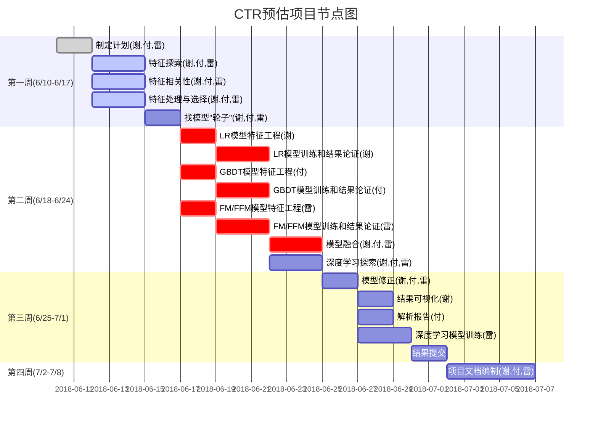

# CTR项目计划

作者：谢飞()，付雄()，雷坤 (Nukiel)
日期：2018/6/10
[TOC]

## 第一周(6/11~6/17)

- [ ] 数据探索文档
	- [ ] 各数据特征实际意义及与最终目标的推测
		(**谢飞，付雄，雷坤**三人研究结果融合)
		
	- [ ] 各数据特征分布情况，特征间联合分布情况
    	(**谢飞，付雄，雷坤**三人研究结果融合)
    	
	- [ ] 各数据特征与最终结果的分布关系
  		(**谢飞，付雄，雷坤**三人研究结果融合)
  	
	- [ ] 对特征工程的探索与规划的初步计划，打算重点关注哪些特征，准备对特征进行什么处理
  		(**谢飞，付雄，雷坤**三人研究结果融合)
  		

## 第二周(6/18~6/24)

- [ ] 特征工程
	(**谢飞，付雄，雷坤**三人研究结果融合)，**6/19**前完成
	
- [ ] 基本模型训练效果及论证
	- [ ] LR模型
		(**谢飞**完成训练以及论证)，**6/22**前完成
  
	- [ ] GBDT模型
    	(**付雄**完成训练以及论证)，**6/22**前完成
    
	- [ ] FFM模型
    	(**雷坤**完成训练以及论证)，**6/22**前完成
  
- [ ] 模型融合方案
	(**谢飞，付雄，雷坤**三人研究融合方案)，**6/25**前完成
	
- [ ] 深度学习模型探索
	(**谢飞，付雄，雷坤**三人研究讨论)，**6/25**前完成
	
	
  
## 第三周(6/25~7/1)

- [ ] 基本模型
	- [ ] 模型修正，确定最终递交结果模型
		(**谢飞，付雄，雷坤**三人)，**6/26**前完成
		
	- [ ] 结果可视化报告
		(**谢飞**完成)，**6/28**前完成
		
	- [ ] 结果解析报告
		(**付雄**完成)，**6/28**前完成
	
- [ ] 深度学习模型
	- [ ] 模型训练以及结果分析
		(**雷坤**完成)，**6/29**前完成
	
- [ ] CTR预估最终结果提交
	(**谢飞，付雄，雷坤**三人)，**7/1**前完成
	
	  

## 第四周(7/2~7/8)

- [ ] 形成最终文档
	(**谢飞，付雄，雷坤**三人)，**7/8**前完成
	
	​	
## CTR预估项目节点图

