 # 第三部分 各数据特征分布情况以及特征间联合分布情况的分析 

## 1. 各数据特征分布情况

首先分析一下整个数据集的特征分布情况，参照以下列表：

- Column id: 每个特征的名称
- Example value: 该特征取值的样本
- Different value types: 该特征总共有多少不同的取值

| Column id        | Example value                                    | Different Value types |
| ---------------- | ------------------------------------------------ | --------------------- |
| id               | 5.21159374e+11                                   | 40428967              |
| click            | 0,1                                              | 2                     |
| hour             | 14102100 14102101                                | 240                   |
| C1               | 1001 1002 1005 1007 1008 1010 1012               | 7                     |
| banner_pos       | 0 1 2 3 4 5 7                                    | 8                     |
| site_id          | '000aa1a4' ' ... 'fffe8e1c'                      | 4737                  |
| site_domain      | '004d30ed' ... 'ffdec903'                        | 7745                  |
| site_category    | '0569f928' …'f66779e6'                           | 26                    |
| app_id           | '000d6291' ... 'ffef3b38'                        | 8552                  |
| app_domain       | 'fea0d84a'…'ff6630e0'                            | 559                   |
| app_category     | 'd1327cf5' …'fc6fa53d'                           | 36                    |
| device_id        | '00000919' ... 'ffffde2c'                        | 2686408               |
| device_ip        | '00000911' ... 'fffff971'                        | 6729486               |
| device_model     | '000ab70c' ... 'ffe72be2'                        | 8251                  |
| device_type­­­   | 0 1 2 4 5                                        | 5                     |
| device_conn_type | 0 2 3 5                                          | 4                     |
| C14              | 375 ... 24052                                    | 2626                  |
| C15              | 120    216  300  320    480  728  768 1024       | 8                     |
| C16              | 20     36   50   90    250  320  480    768 1024 | 9                     |
| C17              | 112…2758                                         | 435                   |
| C18              | 0 1 2 3                                          | 4                     |
| C19              | 33…1959                                          | 68                    |
| C20              | -1 100000 100001…100248                          | 172                   |
| C21              | 1 … 219                                          | 60                    |

 

## 2. 数值型类别的特征分布情况：

以下是全部数据集在各自特征上，值的分布情况：

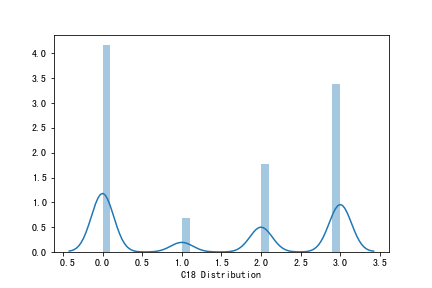

从上图可以看出，C14和C17分布图极为相似，我们可以考虑求出特征的热力图。

如下： 

从热力图我们可以看出，C14和C17确实有着极强的相关性，并且对click的影响也类似，所以可以保留其中一个，所以在这里，我们保留C17,去掉C14。因为C14的取值非常多（2626），而C17的取值较少（435），可以推断C17和C14有可能是包含关系。

## 3. 特征间联合分布情况

从上述热力图中，我们列出与click 相关的热力图的特征，列表如下：

| Column name      | Corr     |
| ---------------- | -------- |
| Id               | 0.000236 |
| hour             | 0.007738 |
| C1               | 0.036478 |
| banner_pos       | 0.026064 |
| device_type      | 0.037686 |
| device_conn_type | 0.083389 |
| C14              | 0.060429 |
| C15              | 0.032616 |
| C16              | 0.130002 |
| C18              | 0.022249 |
| C19              | 0.004313 |
| C20              | 0.057789 |
| C21              | 0.070673 |

选取与click相关性比较高的（threshold=0.0077），筛选出以下特征：

| Column name      | Corr     |
| ---------------- | -------- |
| C1               | 0.036478 |
| banner_pos       | 0.026064 |
| device_type      | 0.037686 |
| device_conn_type | 0.083389 |
| C14              | 0.060429 |
| C15              | 0.032616 |
| C16              | 0.130002 |
| C18              | 0.022249 |
| C20              | 0.057789 |

可以初步得出结论：

以上列出的特征，对用户是否点击广告有着重大影响。都应该保留，并深入挖掘新的特征。

而时间在相关性方面显示出的效果不强，则因考虑对时间维度进行挖掘。

值得注意的是，这里的热力图，仅分析了数值型的特征，对字符型特征还没有考虑进去。

加入字符型类别：site_id, site_domain, site_category, app_id, app_domain, app_category, device_id, device_ip, device_model, 对以上9个特征都对Click总数进行联合分析。

### Click 的比例，出现次数和点击次数与其他特征的联合分布

接下来这个部分，我们分析的是每个特征，在点击数(Click Sum)，出现次数(Click Count)，和点击率（Click Rate = Click Sum / Click Rate ）的联合分布关系（为了方便，在下面叙述中，这三者统称为Click）。

---

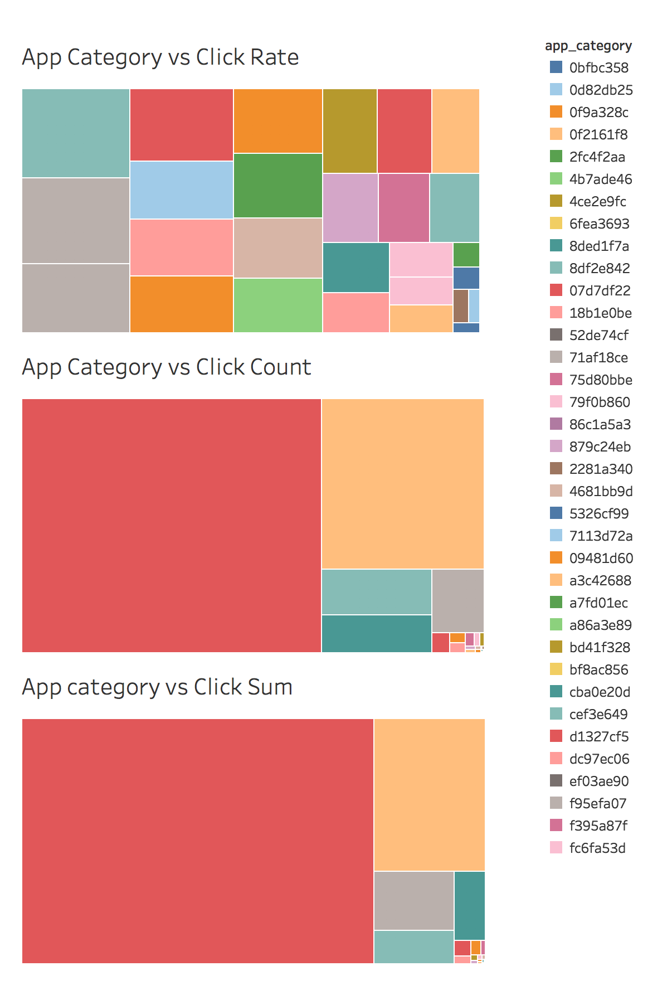

上图是App Category 与Click 三个维度的关系，我们从App Category vs Click Count 和 App category vs Click Sum可以看到，这两者的分布几乎一致。代表着这类广告的出现次数越多，点击数也相应的增大。

但是点击率我们可以从App Category vs Click Rate 看到，没有特别突出的，Top20点击率的类别是非常平均的。

---

上图是App Domain 与Click 三个维度的关系，我们从App Domain vs Click Count 和 App Domain vs Click Sum可以看到，这两者的分布几乎一致。

其中灰色，玫红色代表着这类领域的APP广告投放量比较多，点击数也相应的增大。

但是点击率我们可以从App Domain vs Click Rate 看到，没有特别突出的，几乎所有的App domain 点击率的类别也是非常平均的。

---

上图是App id 与Click 三个维度的关系，我们从App id vs Click Count 和 App id vs Click Sum可以看到，这两者的分布几乎一致。

而绿色代表着这特定的APP 投放了特别多的广告，点击数也相应的增大。

但是点击率我们可以从App id vs Click Rate 看到，投放量最大的App id 对点击率的提高没有显著帮助，反而会引起用户的反感。

---

上图是Banner pos 与Click 三个维度的关系，也就是广告在页面的位置的分析。

我们从 count(click) 和  sum(click) 可以看到，在位置0，和位置1，几乎占领了90%以上的广告投放量。

但是点击率我们可以从 avg(click) 看到，这两个位置对点击率的提高没有显著帮助，反而是位置7，点击率非常的高。

---

上图是C1 与Click 三个维度的关系.

我们从 count(click) 和  sum(click) 可以看到，在类别 1002 和 1005中，几乎占领了90%以上的广告投放量。

但是点击率我们可以从 avg(click) 看到，数量级对点击率的影响并不是很大，但是类别1002贡献了很高的点击率。

---

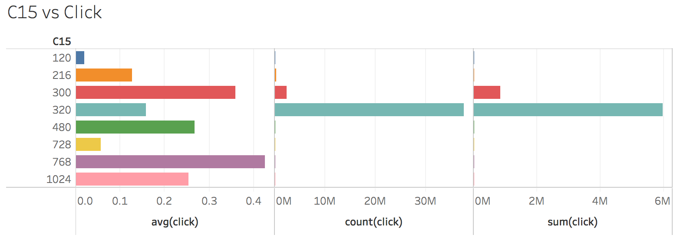

上图是C15 与Click 三个维度的关系.

我们从 count(click) 和  sum(click) 可以看到，在类别 300 和 320 中，几乎占领了90%以上的广告投放量。

但是点击率我们可以从 avg(click) 看到，数量级对点击率的影响并不是很大，而类别 300和 768 贡献了很高的点击率。

---

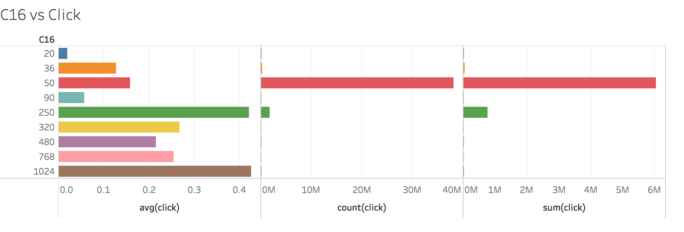

上图是C16 与Click 三个维度的关系.

我们从 count(click) 和  sum(click) 可以看到，在类别 50 和 250 中，几乎占领了90%以上的广告投放量。

但是点击率我们可以从 avg(click) 看到，数量级对点击率的影响并不是很大，而类别 1024 和 250 贡献了很高的点击率。

---

上图是C17 与Click 三个维度的关系.

分布都是比较均衡的。

---

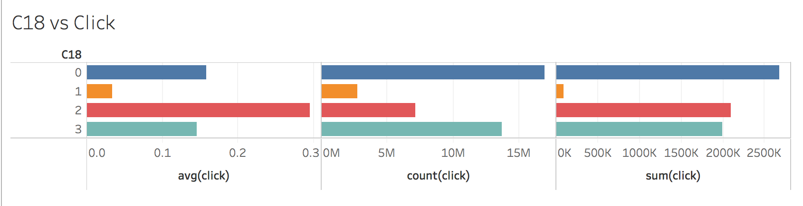

上图是C18 与Click 三个维度的关系.

我们从 count(click) 和  sum(click) 可以看到，在类别 0 和 3 中，几乎占领了70%以上的广告投放量。

而类别2的点击率是最高的。 

C18与点击率的关系，在一定程度上，也跟数量级有关系。

---

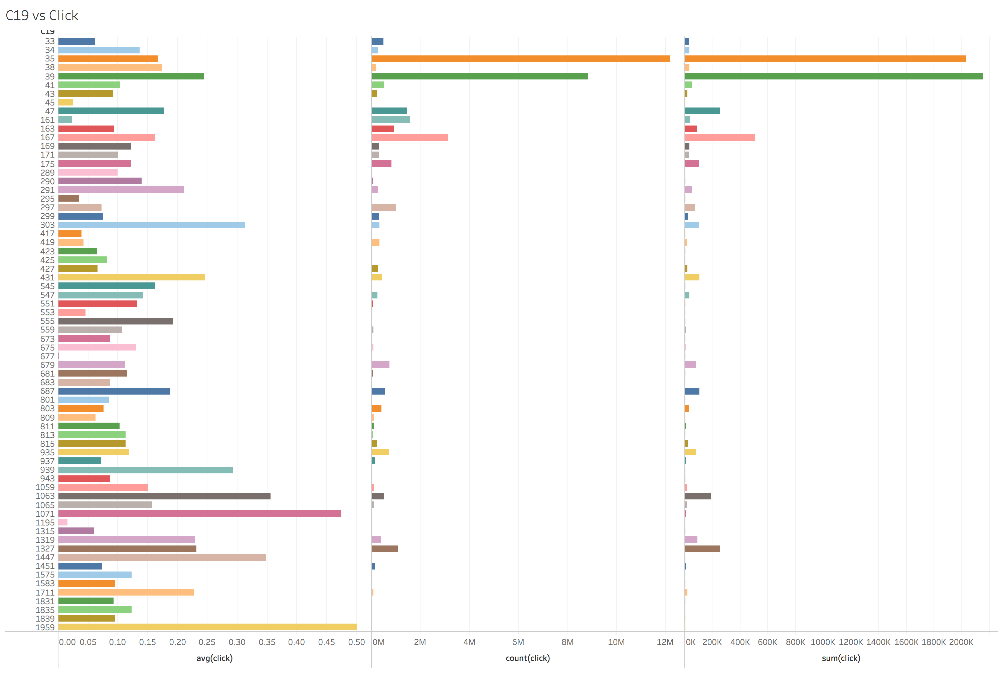

上图是C19 与Click 三个维度的关系.

我们从 count(click) 和  sum(click) 可以看到，在类别 35 和 39 中，几乎占领了90%以上的广告投放量。

但是点击率我们可以从 avg(click) 看到，数量级对点击率的影响并不是很大，而类别 1959 贡献了很高的点击率。

---

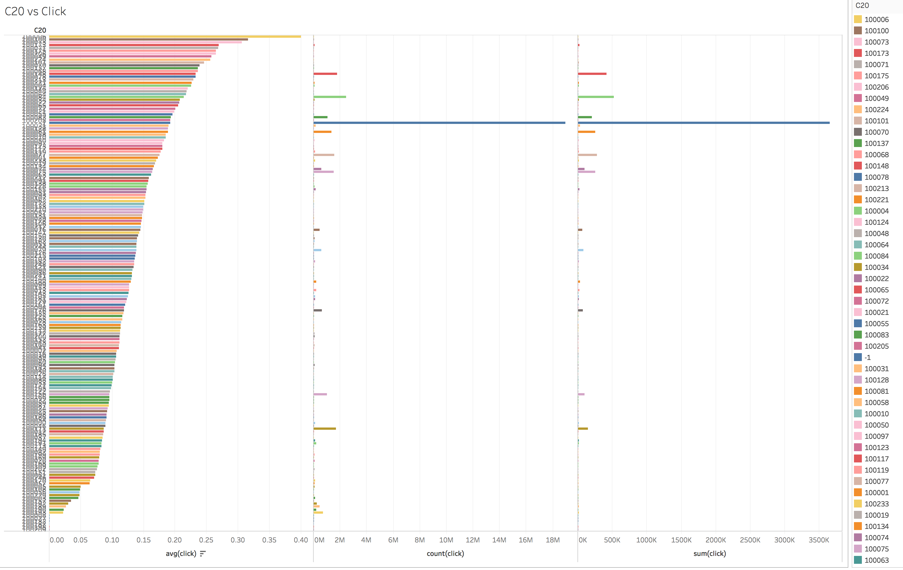

上图是C20 与Click 三个维度的关系.

这个图其实非常有意思，我们可以看到，count 和 sum数量遥遥领先的是类别-1，应该也就是缺省值，而-1对应的点击率非常接近平均点击率，所以在这种情况下，我的建议是对C20的-1值，取附近的值进行替代。

---

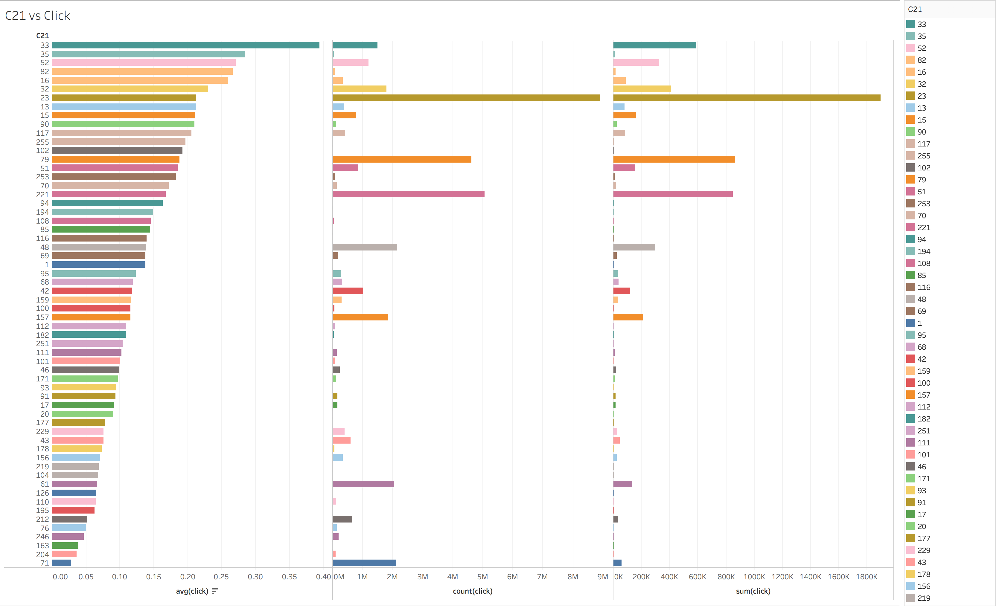

上图是C21 与Click 三个维度的关系.

我们从 count(click) 和  sum(click) 发现，C21 取值为23时，广告的投放量非常大。并且相应的点击数也是很高。

但是点击率我们可以从 avg(click) 看到，数量级对点击率的影响并不是很大，而类别 33 和 35  贡献了很高的点击率。

---

上图是Device Conn 与Click 三个维度的关系.

我们从 count(click) 和  sum(click) 可以看到，在类别 0 和 2 中，几乎占领了90%以上的广告投放量。

但是点击率我们可以从 avg(click) 看到，数量级对点击率的影响成正比。

---

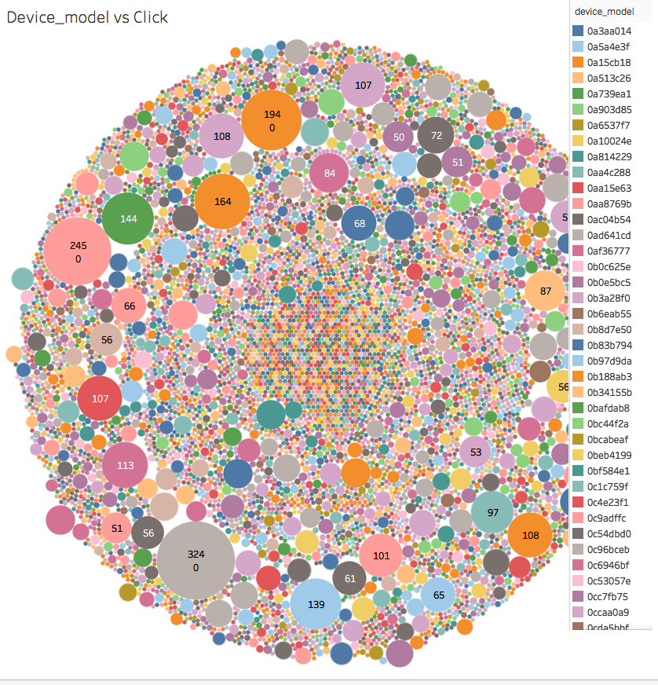

上图是Device Model 与Click 三个维度的关系.

我们从 count(click) 和  sum(click) 可以看到，某些model 的投放量相对比较多，但是对点击率的影响不明显。

所以Device model对点击率的贡献不大。

---

上图是Device Type 与Click 三个维度的关系.

这图也是非常有趣， type 为 0 的 设备广告点击率非常高，但是实际上广告出现的次数非常低。

说明持有device type 为0 的用户，非常喜欢点击广告。

而Device type 为1的用户，被投放广告的次数非常多，对点击率有一定贡献，但是不算显著。

其他type 的点击率，则比较平均。

---

上图是Hour  与Click 三个维度的关系.

这个图也是非常值得思考。我们可以看到某些时段，广告出现次数比较多，点击数也比较多，呈现一个高峰，但是点击率计算下来却是处于低谷。

---

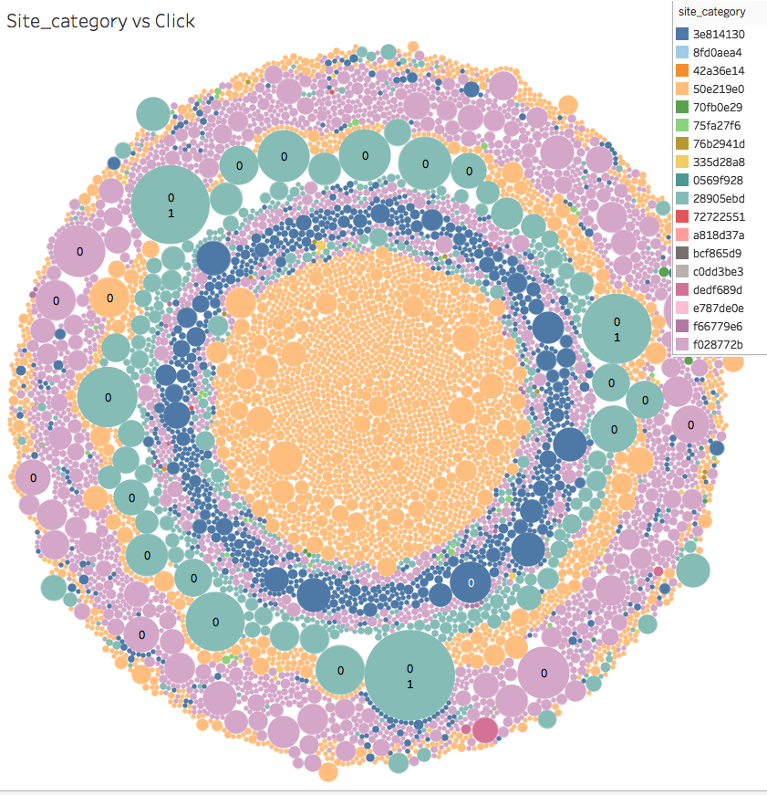

上图是Site Category 与Click 三个维度的关系.

我们从这张图可以看出，category 为**dedf689d** 的site 广告点击率非常高，而投放数却非常非常低，在图上几乎肉眼不可见。 

在count 和 sum遥遥领先的类别 **50e219e0** 点击率相对算高，所以在特定的Site Category中， 广告投放量对点击率的影响还是有一些的。

---

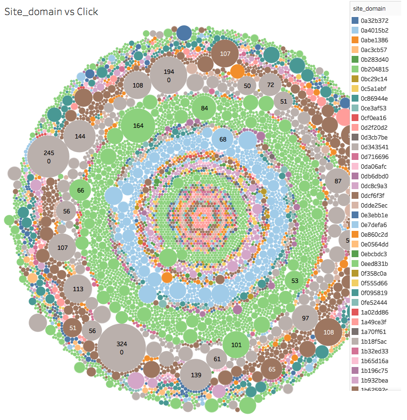

上图类似的分布我们也碰到很多了，说明在Site Domain这个feature上，投放量对点击数是有一定促进作用的，但是对点击率的帮助不大。

---

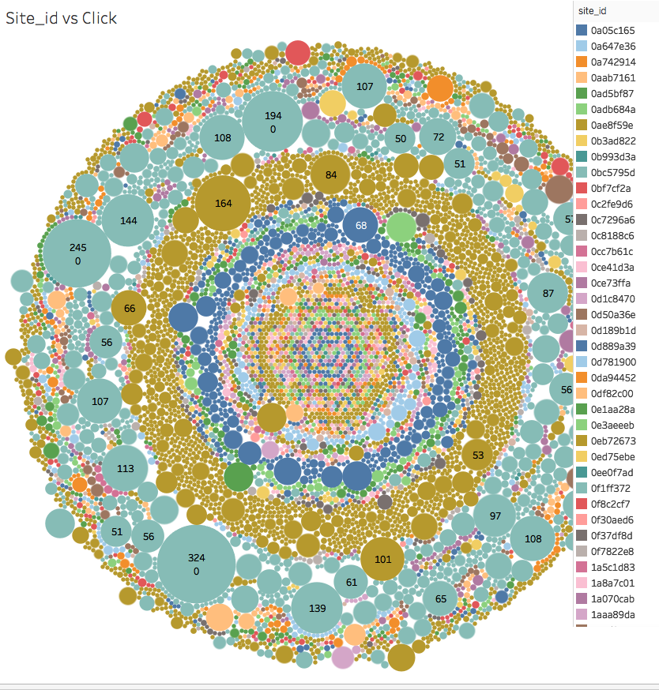

结论同上。

## 小结

经过以上的特征直接的联合分布关系的分析，初步得到的结论如下：

1. C14 与 C17 应该是从属关系， 在这里保留C17。
2. Banner pos 对 Click Rate 的影响显著。
3. 广告投放量有时候在特点的特征上，对点击率有一定促进作用，但是有时是起到反作用，必须具体情况具体分析。
4. Hour 的特征分布有一定的规律性，需要深挖。
5. Device Type 对点击率的影响非常显著，可以代表某种特定的用户群。

