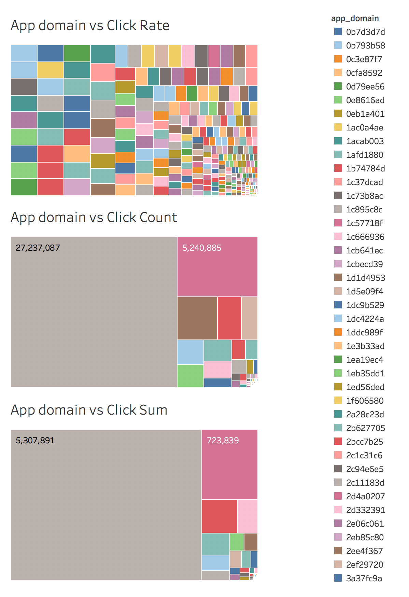
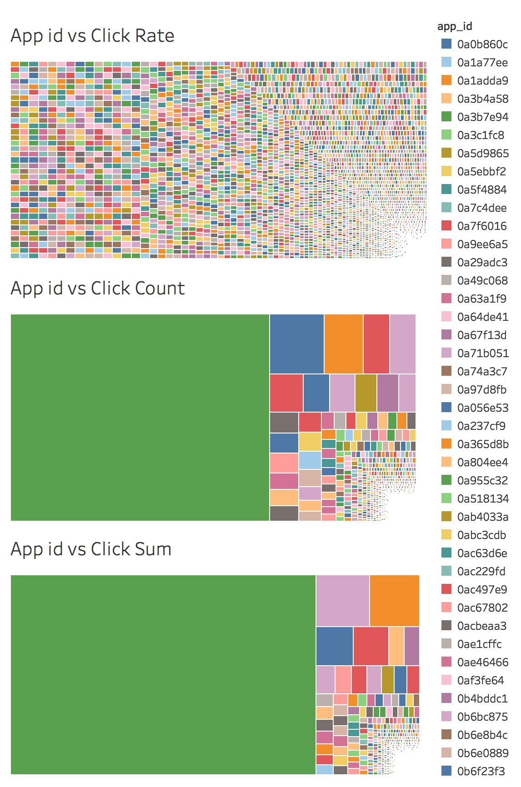
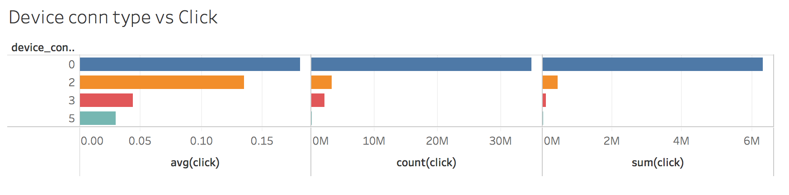

 # 第三部分 各数据特征分布情况以及特征间联合分布情况的分析 

## 1. 各数据特征分布情况

首先分析一下整个数据集的特征分布情况，参照以下列表：

- Column id: 每个特征的名称
- Example value: 该特征取值的样本
- Different value types: 该特征总共有多少不同的取值

| Column id        | Example value                                    | Different Value types |
| ---------------- | ------------------------------------------------ | --------------------- |
| id               | 5.21159374e+11                                   | 40428967              |
| click            | 0,1                                              | 2                     |
| hour             | 14102100 14102101                                | 240                   |
| C1               | 1001 1002 1005 1007 1008 1010 1012               | 7                     |
| banner_pos       | 0 1 2 3 4 5 7                                    | 8                     |
| site_id          | '000aa1a4' ' ... 'fffe8e1c'                      | 4737                  |
| site_domain      | '004d30ed' ... 'ffdec903'                        | 7745                  |
| site_category    | '0569f928' …'f66779e6'                           | 26                    |
| app_id           | '000d6291' ... 'ffef3b38'                        | 8552                  |
| app_domain       | 'fea0d84a'…'ff6630e0'                            | 559                   |
| app_category     | 'd1327cf5' …'fc6fa53d'                           | 36                    |
| device_id        | '00000919' ... 'ffffde2c'                        | 2686408               |
| device_ip        | '00000911' ... 'fffff971'                        | 6729486               |
| device_model     | '000ab70c' ... 'ffe72be2'                        | 8251                  |
| device_type­­­   | 0 1 2 4 5                                        | 5                     |
| device_conn_type | 0 2 3 5                                          | 4                     |
| C14              | 375 ... 24052                                    | 2626                  |
| C15              | 120    216  300  320    480  728  768 1024       | 8                     |
| C16              | 20     36   50   90    250  320  480    768 1024 | 9                     |
| C17              | 112…2758                                         | 435                   |
| C18              | 0 1 2 3                                          | 4                     |
| C19              | 33…1959                                          | 68                    |
| C20              | -1 100000 100001…100248                          | 172                   |
| C21              | 1 … 219                                          | 60                    |

 

## 2. 数值型类别的特征分布情况：

以下是全部数据集在各自特征上，值的分布情况：

从上图可以看出，C14和C17分布图极为相似，我们可以考虑求出特征的热力图。

如下： 

从热力图我们可以看出，C14和C17确实有着极强的相关性，并且对click的影响也类似，所以可以保留其中一个，所以在这里，我们保留C17,去掉C14。因为C14的取值非常多（2626），而C17的取值较少（435），可以推断C17和C14有可能是包含关系。

## 3. 特征间联合分布情况

由于数据集过于巨大，进行数据可视化的时候遇到了一些障碍，如内存不足，运行时间过于缓慢，所以本部分采用了下采样， 取0.05的数据集进行随机采样，生成了如下分析，所以分析结果仅供参考，并不能完全代表整个数据集的分布情况。

从上述热力图中，我们列出与click 相关的热力图的特征，列表如下：

| Column name      | Corr     |
| ---------------- | -------- |
| Id               | 0.000236 |
| hour             | 0.007738 |
| C1               | 0.036478 |
| banner_pos       | 0.026064 |
| device_type      | 0.037686 |
| device_conn_type | 0.083389 |
| C14              | 0.060429 |
| C15              | 0.032616 |
| C16              | 0.130002 |
| C18              | 0.022249 |
| C19              | 0.004313 |
| C20              | 0.057789 |
| C21              | 0.070673 |

选取与click相关性比较高的（threshold=0.0077），筛选出以下特征：

| Column name      | Corr     |
| ---------------- | -------- |
| C1               | 0.036478 |
| banner_pos       | 0.026064 |
| device_type      | 0.037686 |
| device_conn_type | 0.083389 |
| C14              | 0.060429 |
| C15              | 0.032616 |
| C16              | 0.130002 |
| C18              | 0.022249 |
| C20              | 0.057789 |

可以初步得出结论：

以上列出的特征，对用户是否点击广告有着重大影响。都应该保留，并深入挖掘新的特征。

而时间在相关性方面显示出的效果不强，则因考虑对时间维度进行挖掘。

值得注意的是，这里的热力图，仅分析了数值型的特征，对字符型特征还没有考虑进去。

加入字符型类别：site_id, site_domain, site_category, app_id, app_domain, app_category, device_id, device_ip, device_model, 对以上9个特征都对Click总数进行联合分析。

### Click 总数与字符型类别的联合分布

